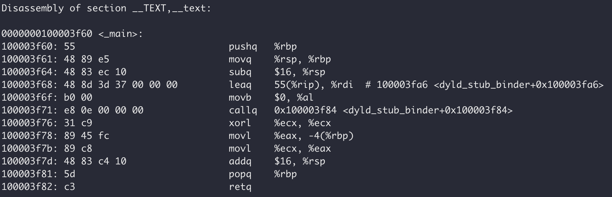

## 程序编译

Hello World程序的编译

```c
#include <stdio.h>

int main()
{
  printf("Hello World\n");
}
```

使用gcc进行编译

```shell
gcc main.c -o main
```

主要是经过下面四个步骤

- 预处理  .c --> .i
- 编译 .i --> .s
- 汇编 .s --> .o
- 链接 .o + 其他库 --> 可执行文件

我们也可以手动控制编译流程:

源文件生成预处理文件： gcc -E HelloWorld.c -o HelloWorld.i
预处理文件生成编译文件： gcc -S HelloWorld.i -o HelloWorld.s
编译文件生成汇编文件： gcc -c HelloWorld.s -o HelloWorld.o
汇编文件生成可执行文件：gcc HelloWorld.o -o HelloWorld
源文件生成可执行文件：gcc HelloWorld.c -o HelloWorld
Linux系统运行可执行文件：./HelloWorld

## 程序装载执行

我们用 objdump -d main 程序，得到 /lesson01/HelloWorld.dump，其中有很多库代码（只需关注 main 函数相关的代码），如下图：



以上图中，分成四列：第一列为地址；第二列为十六进制，表示真正装入机器中的代码数据；第三列是对应的汇编代码；第四列是相关代码的注释。这是 x86_64 体系的代码，由此可以看出 x86 CPU 是变长指令集。


