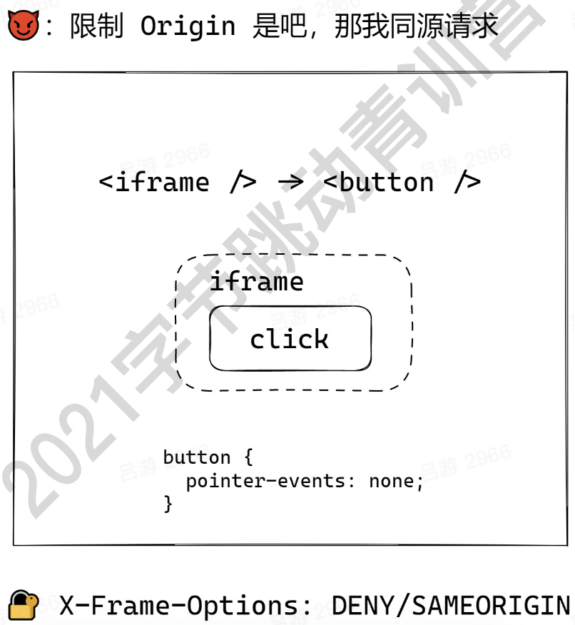
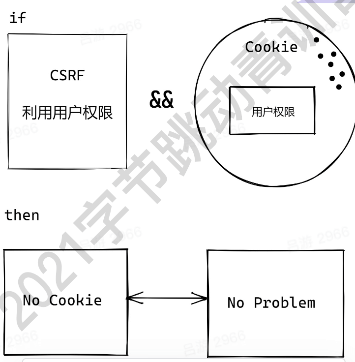
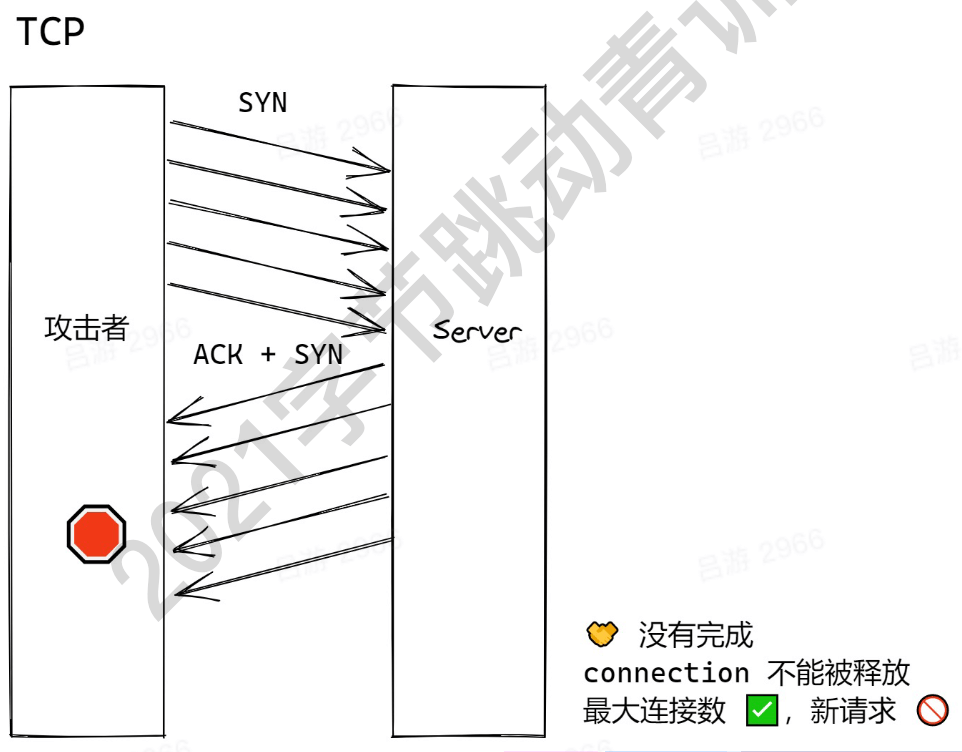
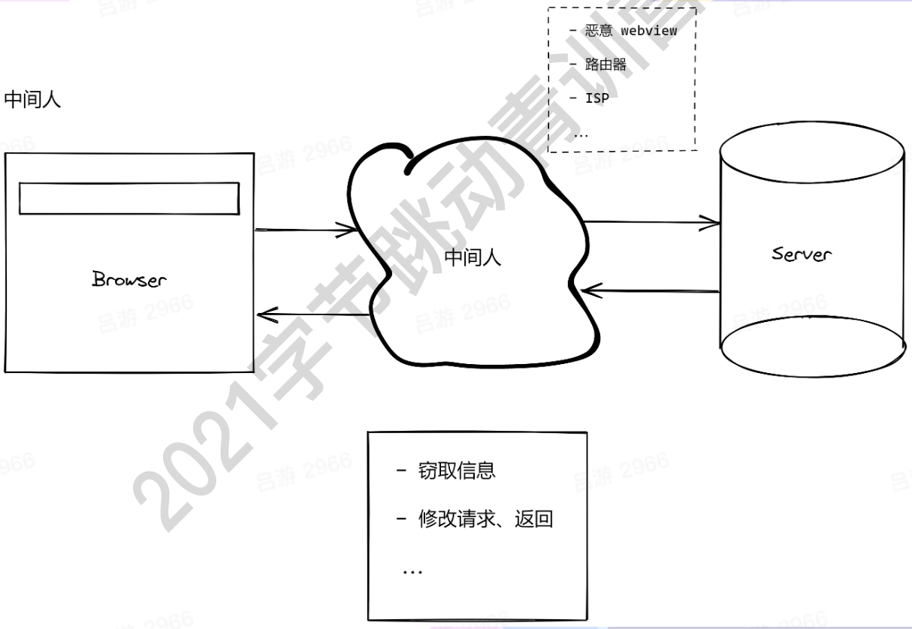
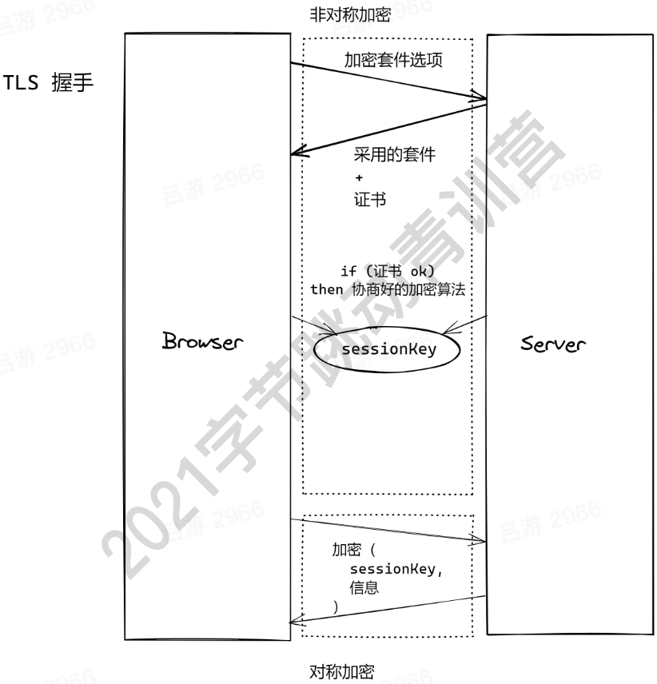

## Cross-Site Scripting(XSS)

跨站脚本攻击，指攻击者将恶意脚本插入到页面中进行执行。

- 开发者盲目信任用户提交的内容
- 直接使用字符串生成 dom

特点：

- 通常难以从 UI 上感知（暗地执行脚本）
- 窃取用户信息（cookie/token）
- 绘制 UI（例如弹窗），诱骗用户点击/填写表单

```js
public async submit(ctx) {
  const { content, id } = ctx.request.body;
  // 没有对centent进行校验
  await db.save({
    content,
    id
  });
}

public async render(ctx) {
  const { content } = await db.query({
    id: ctx.query.id
  });
    // 没有对 centent 过滤
  ctx.body = `<div>${content}</div>`;
}
```

攻击者可以提交以下代码：

```js
fetch('/submit', {
  body: Json.stringify({
    id: '1',
    content: `<script>alert("xss");</script>`,
  }),
});
```

### Stored XSS

- 恶意脚本被存在数据库中
- 访问页面 -> 读数据 === 被攻击
- 危害最大，对全部用户可见

举个例子：假如爱奇艺受到了 xss 攻击，你的用户名和密码就有可能被窃取，从此电商网站上就多了一个共享账户。

### Reflected XSS

- 不涉及数据库
- 从 URL 上攻击，注入在服务端完成

举个例子：

有这样一个 URL `host/path/?param=<script>alert('123')</script>`

```js
public async render(ctx) {
  const { param } = ctx.query;
  ctx.status = 200;
  ctx.body = `<div>${param}</div>`;
}
```

### DOM-based XSS

- 不需要服务器的参与
- 发起和执行，全在浏览器完成

URL `host/path/?param=<script>alert('123')</script>`

```js
const content = new URL(location.href).searchParams.get('params');
const div = document.createElement('div');
// 😈😈 恶意脚本注入
div.innerHTML = content;
document.body.append(div);
```

### Mutation-based XSS

- 利用了浏览器渲染 DOM 的特性（独特优化）
- 不同浏览器，会有区别（按浏览器进行攻击）

下面代码会被部分浏览器优化
`<noscript><p title="</noscript>`

从而变成

```html
<noscript>
  <p title="
</noscript>
<image src="x" onerror="alert(1)">
  "">"
```

### 防御XSS

- 永远不要相信用户的提交信息
- 不要将用户提交的内容直接转换成DOM

前端：
- 主流框架默认防御XSS
- google-closure-library

服务端（Node）

- DOMPurify

仍要注意一下部分：

- string -> DOM
- 上传SVG
- 自定义跳转链接
- 自定义样式（例如：background: url(xxx)）


## Cross-site request forgery(CSRF)

跨站伪造请求

- 在用户不知情的前提下
- 利用用户的权限（cookie）
- 构造指定 HTTP 请求，窃取或修改用户敏感信息

主动请求

```html
<a href="https://bank.com/transfer?to=hacker&amount=100">点我抽奖</a>
```

被动请求

```html

```

### Same-origin Policy

HTTP请求：同源👌

- 协议
- 域名
- 端口

### Content Security Policy(CSP)

- 哪些源(域名)被认为是安全的
- 来自安全源的脚本可以执行，否则直接抛错
- 对eval + inline script说 🚫

通过配置服务器请求头部

```shell
Content-Security=Policy: script-src 'self' #同源
Content-Security=Policy: script-src 'self' https://domain.com
```

浏览器meta

```html
<meta http-equiv="Content-Security-Policy" content="script-src self">
```

### CSRF的防御

推荐在中间件中，对csrf进行统一处理，例如Spring Security，可以定义请求的fliter。

- 限制请求的Origin和Referer（同源请求中，GET+HEAD不发送Origin需要特别处理）
- 使用token，token和用户绑定，要有过期时间
- GET !== GET + POST 写接口不要偷懒

#### iframe攻击



#### SameSite Cookie



## Injection

### SQL Injection

请求携带sql参数（恶意注入）-> server拼接参数，运行sql code -> 获取数据、删除数据、修改数据


```js
// 读取请求字段，以字符串拼接SQL
public async renderForm(ctx) {
  const { username, form_id } = ctx.query;
  const result = await sql.query(`
    SELECT a, b, c FROM table
    WHERE username = ${username}
    AND form_id = ${form_id}
  `);
  ctx.body = renderForm(result);
}
```

攻击者如果提交以下代码：

```js
fetch("/api", {
  method: "POST",
  headers: {
    "Content-Type": "applicaiton/json",
  },
  body: JSON.stringify({
    username: "any; DROP TABLE table;"
  })
})
```

这就会变成下面的sql语句

```sql
SELECT XXX FROM XXX; DROP TABLE table;
```

🎉：被动删库跑路成就达成 ✅

### Injection 不至于 SQL

- CLI
- OS command
- Server-Side Request Forgery(SSRF)，服务端伪造请求（严格来说SSRF不是注入，但是原理类似）

```js
public async convertVideo(ctx) {
  const { video, options } = ctx.request.body;
  exec(`convert-cli ${video} -o ${options}`);
  ctx.body = "ok";
}
```

那这就很危险了，比如：

```js
fetch("/api", {
  method: "POST",
  body: JSON.stringify({
    options: `&& rm -rf xxx`
  })
})
```

还有例如服务器暴露了一些重要文件，比如nginx的配置文件，那么攻击者就可以将请求修改成前往第三方服务器

#### SSRF demo

请求用户自定义的callback url，从而导致内网内容的泄露
```js
public async webHook(ctx) {
  //callback 可能是内网url
  ctx.body = await fetch(ctx.query.callback);
}
```

### 防御Injection

#### SQL

- 找到项目中查询 SQL 的地方
- 使用 prepared statement

#### beyond SQL

- 最小权限原则：禁止 sudo || root
- 建立允许名单 + 过滤 ： rm
- 对 URL 类型参数进行协议、域名、ip等限制：禁止访问内网


## Denial of Service(DoS)

> 服务拒绝：通过某种方式（构造特定请求），导致服务器资源被显著消耗，来不及响应更多请求，导致请求挤压，进而雪崩效应。

### ReDoS: 基于正则表达式的 DoS

正则表达式： `/^((ab)*)+$/` 
字符串：`abababababababa`

末尾的a会导致不断进行匹配，从而使得响应时间增加，接口吞吐量减少。

### Distributed DoS(DDoS)

短时间内，来自大量僵尸设备的请求流量，服务器不能及时完成全部请求，导致请求堆积，进而雪崩效应，无法响应新请求。

**「不搞复杂的，量大就完事儿了」**

攻击特点

- 直接访问 IP
- 任意 API
- 消耗大量带宽（耗尽）

#### SYN Flood



### 防御DDoS

- 流量治理
  - 负载均衡
  - API网关
  - CDN
- 快速自动扩容
- 非核心服务降级


## 传输层攻击

### 中间人攻击


原因：

- 明文传输
- 信息篡改不可知
- 对方身份未验证

### 防御中间人

HTTPS

- 可靠性：加密
- 完整性：MAC验证
- 不可抵赖性：数字签名

#### TLS 1.2



#### HTTPS完整性

传输内容：加密信息 + 加密信息_hash

对hash值进行校验

#### 数字签名

签名执行者有两样东西:

- privateKey
- publicKey

私钥 + 内容 ---> signature

publicKey: 判断 signature是否是使用privateKey生成的

浏览器验证证书和CA（Certificate Authority 证书机构）的publicKey。

> 当签名算法不够健壮的时候，又可能会被暴力破解。

#### HTTP Strict- -Transport- Security(HSTS)

HSTS 是 HTTP 严格传输安全（HTTP Strict Transport Security） 的缩写。 这是一种网站用来声明他们只能使用安全连接（HTTPS）访问的方法。 如果一个网站声明了 HSTS 策略，浏览器必须拒绝所有的 HTTP 连接并阻止用户接受不安全的 SSL 证书。 目前大多数主流浏览器都支持 HSTS (只有一些移动浏览器无法使用它)。

#### Subresource Integrity(SRI)

静态资源一般放到CDN，如果CDN被劫持，我们可以对比hash。

```html
<script src="https://example.com/app.js" integrity="sha384-{some-hash-value}" crossorigin="anonymous"></script>
```

验证伪代码

```js
const remoteHash = hash(content);
if (tagHash != remoteHash) {
  throw new Error("wrong hash");
}
```

#### Feature Policy/Permission Policy

限制一个源（页面）下，可以使用哪些功能：
- camera
- microphone
- autoplay

```html
<iframe allow="xxx" />
```

## 阅读材料

- [DDoS攻击是什么_DDoS是什么_DDoS云防御-AWS云服务 (amazon.com)](https://aws.amazon.com/cn/shield/ddos-attack-protection/)
- [关于 Web 安全突然想到的 · Issue #32 · AngusFu/diary (github.com)](https://github.com/AngusFu/diary/issues/32)
- [SameSite 那些事 | 怡红院落 (imnerd.org)](https://imnerd.org/samesite.html)
- [Amazon.com: Web Application Security: Exploitation and Countermeasures for Modern Web Applications: 9781492053118: Hoffman, Andrew: Books](https://www.amazon.com/Web-Application-Security-Exploitation-Countermeasures/dp/1492053112/ref=sr_1_3?crid=3KZBER4W7Z6JF&dchild=1&keywords=web+security&qid=1627822659&sprefix=web+secu%2Caps%2C360&sr=8-3)

