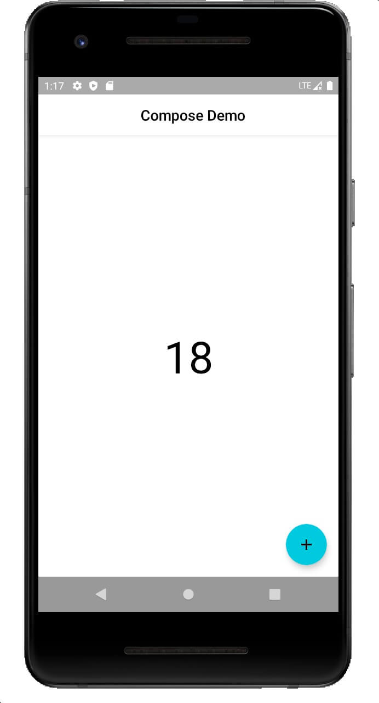

<iframe frameborder="no" border="0" marginwidth="0" marginheight="0" width="100%" height=86 src="//music.163.com/outchain/player?type=2&id=1357774614&auto=0&height=66"></iframe>

## 相关资源

- [入门路线](https://developer.android.google.cn/courses/pathways/compose)
- [视频资料](https://list.youku.com/albumlist/show/id_59672719)
- [CodeLab](https://developer.android.google.cn/courses/pathways/compose)
- [中文文档](https://docs.compose.net.cn/)

## Compose简介

>Jetpack Compose 是用于构建原生界面的新款 Android 工具包。它可简化并 加快 Android 上的界面开发。使用更少的代码、强大的工具和直观的 Kotlin API，快速让应用生动而精彩。

原来的 View 体系是 bundled，版本的兼容和 debug 非常繁琐，而 Compose 不与系统强绑定，版本的更新迭代不太会影响用户体验。

## 编写UI以及预览

```kotlin
@Composable
fun Greeting(name: String) {
    Text("Hello $name")
}
```

这是新建项目里有的一个函数，可以看到它放了一个`Text`组件，这个组件会在屏幕上显示一个文字。

其中`@Composable`注解将贯穿整个`Jetpack Compose`的开发。凡是有该注解修饰的函数就可以被解析成 UI；注意，这是一个**函数到 UI 的映射**。如果没有注解，该函数则是一个普通的函数。**Compose注解改变了这个函数的类型**。那么这是如何做到的，可以看到下面这个`Composable`注解的源码，其中`@Retention(AnnotationRetention.BINARY)`这一行表示`Composable`在二进制级别是可见的，kotlin插件通过这个注解在编译期做的。

```kotlin
@MustBeDocumented
@Retention(AnnotationRetention.BINARY)
@Target(
    // function declarations
    // @Composable fun Foo() { ... }
    // lambda expressions
    // val foo = @Composable { ... }
    AnnotationTarget.FUNCTION,

    // type declarations
    // var foo: @Composable () -> Unit = { ... }
    // parameter types
    // foo: @Composable () -> Unit
    AnnotationTarget.TYPE,

    // composable types inside of type signatures
    // foo: (@Composable () -> Unit) -> Unit
    AnnotationTarget.TYPE_PARAMETER,

    // composable property getters and setters
    // val foo: Int @Composable get() { ... }
    // var bar: Int
    //   @Composable get() { ... }
    AnnotationTarget.PROPERTY_GETTER
)
annotation class Composable
```

**这个注解区分了 UI 和非 UI**，UI的调用环境和非 UI 的使用环境又不一样。就像在 Kotlin 协程里，若要调用一个协程，首先需要有一个协程环境；同理，调用一个UI，只能在 UI 的环境调用；调用一个 Composable 函数，不能用非 Composable 函数调用。

```kotlin
@Preview
@Composable
fun PreviewGreeting() {
    Greeting(name = "Kcqnly")
}
```

通过添加`@Preview`注解，可以在Android Studio的侧边栏里实现实时的预览。

## 重组

- 可组合函数可以按任何顺序执行。
-  可组合函数可以并行执行。
-  重组会跳过尽可能多的可组合函数和 lambda。
-  重组是乐观的操作，可能会被取消。 
- 可组合函数可能会像动画的每一帧一样非常频繁地运行。

通过对代码的分层处理，可以写出性能更高的Compose代码，因为在状态更改的时候，compose只会把需要更新的组件刷新一次。可以通过分层实现局部刷新。

## 使用Compose写一个计数器Demo

Flutter的默认demo就是一个计数器，下面使用Compose实现一个这个效果。

### 编写AppBar

文档中关于Title的描述如下：
>This TopAppBar has slots for a title, navigation icon, and actions. Note that the title slot is inset from the start according to spec - for custom use cases such as horizontally centering the title, use the other TopAppBar overload for a generic TopAppBar with no restriction on content.

可以通过将`Text`的`modifier`需要设置成`Modifier.fillMaxWidth()`，来实现居中效果。

```kotlin
@Composable
fun AppBar() {
    TopAppBar(
        title = {
            Text(
                modifier = Modifier.fillMaxWidth(),
                text = "Compose Demo",
                color = Color.Black,
                textAlign = TextAlign.Center
            )
        },
        backgroundColor = Color.White,
    )
}
```

### 编写页面Body

```kotlin
@Composable
fun Body(num: Int) {
    Box(Modifier.fillMaxSize(), contentAlignment = Alignment.Center) {
        Text(
            modifier = Modifier.fillMaxWidth(),
            text = "$num",
            color = Color.Black,
            textAlign = TextAlign.Center,
            fontSize = 60.sp
        )
    }
}
```

### 编写页面整体结构

`Compose`提供了`Scaffold`这样的一些基本组件。

```kotlin
class MainActivity : ComponentActivity() {
    override fun onCreate(savedInstanceState: Bundle?) {
        super.onCreate(savedInstanceState)
        setContent {
            MaterialTheme {
                Scaffold(
                    topBar = { AppBar() },
                    content = { Body(0) }
                )
            }
        }
    }
}
```

## 状态更新

现在这个页面是不会发生改变，我们需要添加一个按钮来实现更新`count`。但是数值的更新如何引起页面的更新，这就需要了解一下`Compose`的状态概念。文档如下：

>To add internal state to a composable, use the mutableStateOf function, which gives a composable mutable memory. To not have a different state for every recomposition, remember the mutable state using remember. And, if there are multiple instances of the composable at different places on the screen, each copy will get its own version of the state.

根据文档，我需要使用`mutableStateOf`这个函数。

```kotlin
var count by remember { mutableStateOf(0) }
```

之后再添加一下`FloatingButton`。完整代码如下：

```kotlin
class MainActivity : ComponentActivity() {
    override fun onCreate(savedInstanceState: Bundle?) {
        super.onCreate(savedInstanceState)
        setContent {
            var count by remember { mutableStateOf(0) }
            MaterialTheme {
                Scaffold(
                    topBar = { AppBar() },
                    floatingActionButton = {
                        FloatingActionButton(
                            backgroundColor = Color(0xff47c7dc),
                            onClick = { count++ },
                            content = {
                                Icon(
                                    imageVector = Icons.Outlined.Add,
                                    contentDescription = "Add Button"
                                )
                            }
                        )
                    },
                    content = { Body(count) }
                )
            }
        }
    }
}
```


