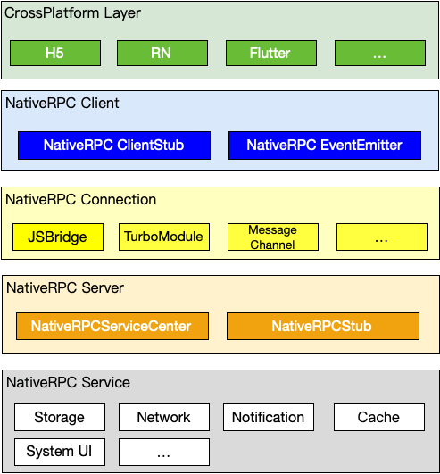
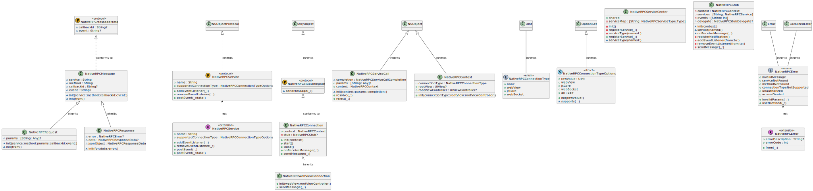
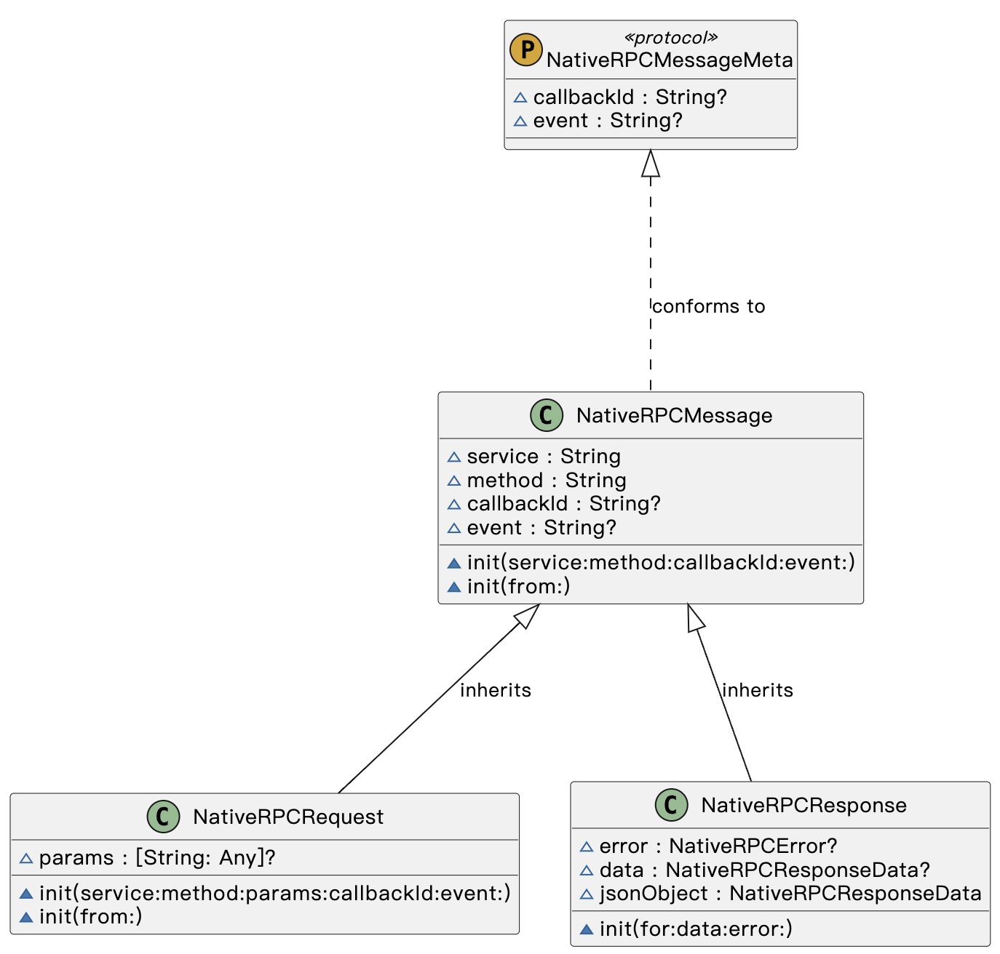

## 背景

现代 App 中通常会引入像 WebView、React Native、Flutter 这样的跨端解决方案，它们可以快速地实现功能的开发和上线。在使用这些方案时，都不可避免的会有一些功能需要使用 Native 能力，在涉及调用应用的 Native 能力的时候，它们都会采用一套自己独立的通信方式，对不同跨端方式提供 Native 能力的时候，不能实现完全的代码复用。本文主要介绍参考大厂相关跨端基建设计的一个统一跨端通信框架，对应用抹除跨端技术差异，实现 Native 资产复用。

源码地址：https://github.com/FeliksLv01/NativeRPCServiceKit

## 整体架构

框架借鉴服务端 RPC 协议概念，设计了 NativeRPC 协议。



原生侧将应用的一些基础能力封装为 NativeRPCService，并注册到 ServiceCenter 中。跨端应用侧通过和原生侧建立 NativeRPCConnection，来实现 NativeRPC 的调用。

通信方面，跨端侧和原生侧都需要实现一个 NativeRPCStub，用于实现 RPC 请求和响应数据的解析和组装。



## 通信协议部分



请求数据如下：

```json
{
	"_meta": {
		"callbackId": 15667769
	},
	"method": "addCourse",
	"service": "course.storage",
	"params": {
		"name": 1
	}
}
```

meta 部分对应 UML 中的 NativeRPCMessageMeta，代表 RPC 消息的元数据。包含 callbackId 和 event 两个都是可空，分别对应正常调用和事件通知。callbackId 用于标记请求序列号，返回 Response 时，也需要带上 callbackId，用于跨端侧匹配回调。service 对应注册到 ServiceCenter 中的服务代号，method 是方法代号。params 是一个 map 类型的数据，在调用方法的是会传入。

response 数据如下：

```json
{
	"_meta": {
		"callbackId": 15667769
	},
	"code": 1000
}
```

### 通信全流程

TODO：
