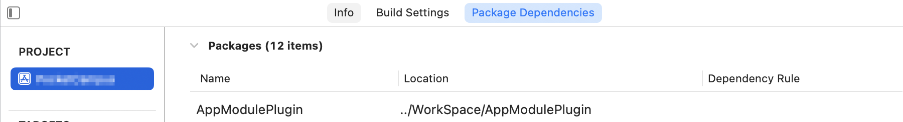
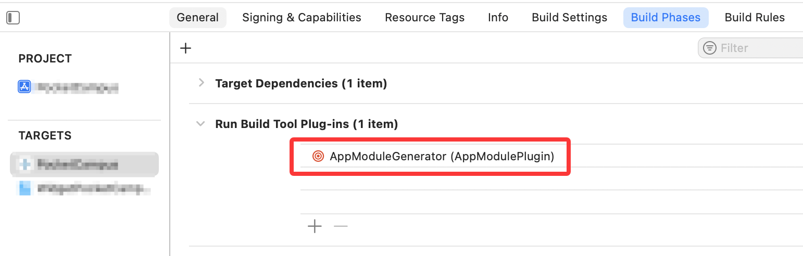
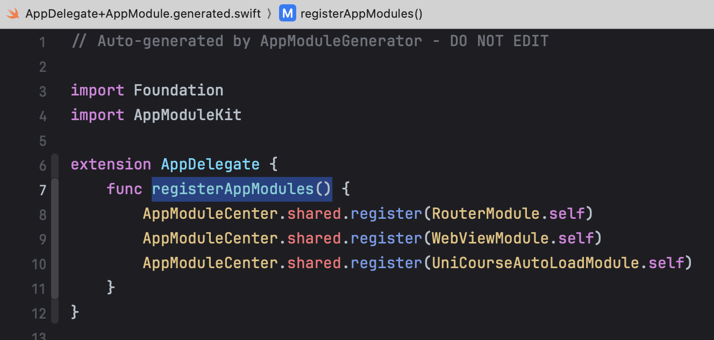

在 [WWDC2022](https://developer.apple.com/videos/play/wwdc2022/110401/) 上，苹果介绍了 Build Tool Plugin，可以用来在编译前生成源代码。

这里记录一下使用 Build Tool Plugin 做源代码生成的全过程，实现在编译时自动生成模块注册代码，无需手动注册。

## 使用场景

在 iOS 工程里，我们往往会在 AppDelegate 中的 `application(_:didFinishLaunchingWithOptions:)` 中去做一些功能模块的注册，如下所示：

```swift
class AppDelegate: UIApplicationDelegate {
    func application(_ application: UIApplication, didFinishLaunchingWithOptions launchOptions: [UIApplication.LaunchOptionsKey: Any]?) -> Bool {
        // 路由注册
        Navigator.register("/xxx", {
            return XXXViewController()
        })
        // 模块注册
        ModuleManager.register(XXXModule.self)
        // ...
        return true
    }
}
```

这种手动注册的方式容易遗漏。在使用 OC 的时候，很多框架会通过宏定义，将要注册的模块存放到指定的 segment 和 section 中，在启动之后读取来完成注册。而在 Swift 为主的工程里，我们可以使用 Build Tool Plugin 来自动生成注册代码。

## 创建 Build Tool Plugin

Xcode -> File -> New -> Package -> Build Tool Plugin。

生成代码的思路：扫描源码中所有实现了 `AppModule` 协议的模块，然后生成注册代码。要做到扫描并分析源码，我们需要使用到 swift-syntax 库，插件的 Package.swift 如下所示：

```swift
// swift-tools-version: 5.9
import PackageDescription

let package = Package(
    name: "AppModulePlugin",
    platforms: [.macOS(.v13), .iOS(.v13)],
    products: [
        .plugin(
            name: "AppModuleGenerator",
            targets: ["AppModuleGenerator"]
        )
    ],
    dependencies: [
        .package(url: "https://github.com/swiftlang/swift-syntax.git", from: "600.0.0-latest")
    ],
    targets: [
        .plugin(
            name: "AppModuleGenerator",
            capability: .buildTool(),
            dependencies: ["AppModuleGeneratorTool"]
        ),
        .executableTarget(
            name: "AppModuleGeneratorTool",
            dependencies: [
                .product(name: "SwiftSyntax", package: "swift-syntax"),
                .product(name: "SwiftParser", package: "swift-syntax"),
            ]
        ),
    ]
)
```

-   Plugin Target ( AppModuleGenerator )

-   这是一个插件目标，通过 .plugin() 声明
-   设置了 .buildTool() 能力，表明这是一个构建工具插件
-   这个插件本身是与 Xcode 构建系统集成的接口层，负责：
    -   定义插件的配置
    -   处理构建系统的调用
    -   决定何时以及如何调用实际的代码生成工具
-   Executable Target ( AppModuleGeneratorTool )

-   这是一个可执行目标，通过 .executableTarget() 声明
-   包含实际的代码生成逻辑
-   依赖 SwiftSyntax 和 SwiftParser 来解析和处理 Swift 源代码
-   这是实际执行源代码分析和生成的工具

## Plugin 代码实现

```swift
// Plugins/AppModuleGenerator/AppModuleGenerator.swift
import Foundation
import PackagePlugin

// 主入口，实现 BuildToolPlugin 协议用于 SPM 构建系统
@main
struct AppModuleGenerator: BuildToolPlugin {
    // 创建构建命令，在构建时会被 SPM 调用
    // - context: 提供插件运行环境信息
    // - target: 当前正在构建的目标
    func createBuildCommands(context: PluginContext, target: Target) async throws -> [Command] {
        // 1. 获取目标目录和源代码目录
        // - pluginWorkDirectory: 插件的工作目录，用于存放生成的文件
        // - directory: 目标的源代码根目录
        let targetDir = context.pluginWorkDirectory
        let sourceRoot = target.directory.string

        // 2. 获取可执行工具的路径
        // 获取在 Package.swift 中定义的 AppModuleGeneratorTool 可执行文件
        let generatorTool = try context.tool(named: "AppModuleGeneratorTool")

        // 3. 定义生成文件的输出路径
        // 生成的文件将被命名为 AppDelegate+AppModule.generated.swift
        let outputFile = targetDir.appending("AppDelegate+AppModule.generated.swift")

        // 4. 构造构建命令
        // 返回一个构建命令数组，这里只有一个命令
        return [
            .buildCommand(
                displayName: "Generating AppModule Registrations", // 在构建日志中显示的名称
                executable: generatorTool.path,                    // 要执行的工具路径
                arguments: [                                       // 传递给工具的命令行参数
                    "--target-dir", targetDir.string,
                    "--source-root", sourceRoot,
                ],
                environment: [                                     // 传递给工具的环境变量
                    "TARGET_DIR": targetDir.string,
                    "SOURCE_ROOT": sourceRoot,
                ],
                outputFiles: [outputFile]                         // 声明输出文件，用于增量构建
            )
        ]
    }
}

// 为 Xcode 项目提供支持
#if canImport(XcodeProjectPlugin)
    import XcodeProjectPlugin

    // 扩展支持 Xcode 项目的插件功能
    extension AppModuleGenerator: XcodeBuildToolPlugin {
        // 与 SPM 版本类似，但使用 Xcode 特定的上下文和目标类型
        func createBuildCommands(context: XcodePluginContext, target: XcodeTarget) throws
            -> [Command]
        {
            // 1. 获取目标目录和源代码目录
            // 在 Xcode 项目中，源代码根目录是整个项目目录
            let targetDir = context.pluginWorkDirectory
            let sourceRoot = context.xcodeProject.directory.string

            // 2. 获取可执行工具的路径
            let generatorTool = try context.tool(named: "AppModuleGeneratorTool")

            // 3. 定义生成文件的输出路径
            let outputFile = targetDir.appending("AppDelegate+AppModule.generated.swift")

            // 4. 构造构建命令
            // 配置与 SPM 版本相同
            return [
                .buildCommand(
                    displayName: "Generating AppModule Registrations",
                    executable: generatorTool.path,
                    arguments: [
                        "--target-dir", targetDir.string,
                        "--source-root", sourceRoot,
                    ],
                    environment: [
                        "TARGET_DIR": targetDir.string,
                        "SOURCE_ROOT": sourceRoot,
                    ],
                    outputFiles: [outputFile]
                )
            ]
        }
    }
#endif
```

主要是用来调用实际的代码生成工具（AppModuleGeneratorTool）, 并配置生成文件的输出路径，核心的代码生成逻辑都在 AppModuleGeneratorTool 中实现。

## 代码生成逻辑

```swift
struct AppModuleGeneratorTool {
    static func main() throws {
        // 1. 解析 Plugin 中设置的命令行参数
        let arguments = ProcessInfo.processInfo.arguments
        guard arguments.count >= 5,
            arguments[1] == "--target-dir",
            arguments[3] == "--source-root"
        else {
            throw PluginError.invalidArguments
        }

        let targetDir = arguments[2]
        let sourceRoot = arguments[4]

        // 2. 扫描源代码文件
        let sourceFiles = try scanSourceFiles(at: sourceRoot)

        // 3. 解析实现了 AppModule 的类型
        let modules = try parseModules(from: sourceFiles)

        // 4. 生成注册代码文件
        try generateRegistrationCode(modules: modules, targetDir: targetDir)
    }
    // ...
}

try AppModuleGeneratorTool.main()
```

### 源代码扫描

```swift
/// 扫描指定路径下的所有 Swift 源文件
/// - Parameter path: 要扫描的根目录路径
/// - Returns: 所有找到的 Swift 文件的 URL 数组
/// - Throws: 文件操作相关的错误
private static func scanSourceFiles(at path: String) throws -> [URL] {
    let fileManager = FileManager.default
    let directoryURL = URL(fileURLWithPath: path, isDirectory: true)
    var swiftFiles: [URL] = []

    // 创建文件枚举器
    // - includingPropertiesForKeys: 预加载文件的属性，提高性能
    // - options:
    //   - skipsHiddenFiles: 跳过隐藏文件
    //   - skipsPackageDescendants: 跳过包含 Package.swift 的目录
    let enumerator = fileManager.enumerator(
        at: directoryURL,
        includingPropertiesForKeys: [.isRegularFileKey],
        options: [.skipsHiddenFiles, .skipsPackageDescendants]
    )

    // 遍历目录中的所有文件
    while let fileURL = enumerator?.nextObject() as? URL {
        // 检查是否为常规文件（非目录）且扩展名为 swift
        guard try fileURL.resourceValues(forKeys: [.isRegularFileKey]).isRegularFile == true,
            fileURL.pathExtension == "swift"
        else {
            continue
        }
        swiftFiles.append(fileURL)
    }
    return swiftFiles
}
```

### 源代码解析

```swift
// MARK: - 语法树解析
/// 解析源文件中实现了 AppModule 协议的类型
/// - Parameter files: 要解析的 Swift 源文件 URL 数组
/// - Returns: 实现了 AppModule 协议的类型名称数组
/// - Throws: 文件读取或解析过程中的错误
private static func parseModules(from files: [URL]) throws -> [String] {
    var modules: [String] = []

    // 遍历每个源文件
    for fileURL in files {
        // 读取源文件内容
        let source = try String(contentsOf: fileURL)
        // 使用 SwiftParser 将源代码解析为语法树
        let syntaxTree = Parser.parse(source: source)

        // 创建自定义访问器，用于遍历语法树
        // viewMode: .sourceAccurate 表示需要准确的源代码信息
        let visitor = AppModuleVisitor(viewMode: .sourceAccurate)
        // 遍历语法树，visitor 会收集实现了 AppModule 协议的类型
        visitor.walk(syntaxTree)
        modules.append(contentsOf: visitor.foundModules)
    }

    return modules
}
```

在获取到语法树之后，我们需要遍历语法树，找到实现了 AppModule 协议的类型。这里使用了 SwiftParser 库来解析源代码，并创建了一个自定义访问器 AppModuleVisitor。AppModuleVisitor 是一个继承自 SyntaxVisitor 的类，它会遍历语法树并收集实现了 AppModule 协议的类型。

#### SyntaxVisitor

`SyntaxVisitor` 是 SwiftSyntax 库中的一个核心组件，用于遍历和操作 Swift 代码的语法树（Syntax Tree）。它基于访问者模式（Visitor Pattern），允许你以类型安全的方式遍历语法树的节点，并对特定节点执行操作。基本用法如下：

```swift
import SwiftSyntax
import SwiftParser

class MyVisitor: SyntaxVisitor {
    override func visit(_ node: ClassDeclSyntax) -> SyntaxVisitorContinueKind {
        print("Found class: \(node.name.text)")
        return .visitChildren // 继续遍历子节点
    }

    override func visit(_ node: FunctionDeclSyntax) -> SyntaxVisitorContinueKind {
        print("Found function: \(node.name.text)")
        return .skipChildren // 跳过子节点
    }
}


let source = """
class MyClass {
    func myFunction() {}
}
"""

let syntaxTree = Parser.parse(source: source)
let visitor = MyVisitor(viewMode: .sourceAccurate)
// 遍历语法树
visitor.walk(syntaxTree)

// 输出
// Found class: MyClass
// Found function: myFunction
```

SyntaxVisitor 核心方法：
`visit(_:)` 是 SyntaxVisitor 的核心方法。每个节点类型都有对应的 visit 方法，你可以重写这些方法来处理特定类型的节点。例如：

-   `visit(_ node: ClassDeclSyntax)`
-   `visit(_ node: FunctionDeclSyntax)`
-   `visit(_ node: VariableDeclSyntax)`

visit 方法的返回值`SyntaxVisitorContinueKind`决定了遍历的行为：

-   `.visitChildren`：继续遍历当前节点的子节点。
-   `.skipChildren`：跳过当前节点的子节点。

常用场景：

1. 收集所有类名

```swift
class ClassNameCollector: SyntaxVisitor {
    var classNames: [String] = []

    override func visit(_ node: ClassDeclSyntax) -> SyntaxVisitorContinueKind {
        classNames.append(node.name.text)
        return .visitChildren
    }
}

let source = """
class MyClass {}
class AnotherClass {}
"""

let syntaxTree = Parser.parse(source: source)
let collector = ClassNameCollector(viewMode: .sourceAccurate)
collector.walk(syntaxTree)

print(collector.classNames) // 输出：["MyClass", "AnotherClass"]
```

2. 查找特定函数

```swift
class FunctionFinder: SyntaxVisitor {
    var foundFunctions: [String] = []

    override func visit(_ node: FunctionDeclSyntax) -> SyntaxVisitorContinueKind {
        if node.name.text == "myFunction" {
            foundFunctions.append(node.name.text)
        }
        return .visitChildren
    }
}

let source = """
func myFunction() {}
func anotherFunction() {}
"""

let syntaxTree = Parser.parse(source: source)
let finder = FunctionFinder(viewMode: .sourceAccurate)
finder.walk(syntaxTree)

print(finder.foundFunctions) // 输出：["myFunction"]
```

3. 使用 SyntaxRewriter 修改语法树

```swift
class MyRewriter: SyntaxRewriter {
    override func visit(_ node: FunctionDeclSyntax) -> DeclSyntax {
        // 修改函数名
        let newName = TokenSyntax.identifier("newFunction")
        return super.visit(node.with(\.name, newName))
    }
}

let source = """
func myFunction() {}
"""

let syntaxTree = Parser.parse(source: source)
let rewriter = MyRewriter(viewMode: .sourceAccurate)
let newTree = rewriter.visit(syntaxTree)

print(newTree.description) // 输出：func newFunction() {}
```

#### AppModuleVisitor

了解了 SyntaxVisitor 的基本用法之后，我们就可以很快写出这样一个扫描实现了指定协议 AppModule 的 Visitor。

```swift
class AppModuleVisitor: SyntaxVisitor {
    var foundModules: [String] = []

    override func visit(_ node: ClassDeclSyntax) -> SyntaxVisitorContinueKind {
        checkConformance(in: node)
        return .skipChildren
    }

    private func checkConformance(in node: some DeclGroupSyntax) {
        guard let inheritanceClause = node.inheritanceClause else { return }

        // 检查是否遵循 AppModule 协议
        for inheritedType in inheritanceClause.inheritedTypes {
            let typeName = inheritedType.type.trimmedDescription
            if typeName == "AppModule" {
                // 通过具体类型获取名称
                if let classDecl = node.as(ClassDeclSyntax.self) {
                    foundModules.append(classDecl.name.text)
                }
                break
            }
        }
    }
}
```

### 源代码生成

生成的逻辑就比较简单了，获取到所有实现了 AppModule 协议的类名之后，遍历生成注册方法即可，我这里是通过生成了一个 AppDelegate 的 Extension，提供一个 `registerAppModules` 的方法。

```swift
    private static func generateRegistrationCode(modules: [String], targetDir: String) throws {
        let outputURL = URL(fileURLWithPath: targetDir)
            .appendingPathComponent("AppDelegate+AppModule.generated.swift")

        let codeContent = """
            // Auto-generated by AppModuleGenerator - DO NOT EDIT

            import Foundation
            import AppModuleKit

            extension AppDelegate {
                func registerAppModules() {
                    \(modules.map { "AppModuleCenter.shared.register(\($0).self)" }.joined(separator: "\n        "))
                }
            }
            """

        do {
            try codeContent.write(to: outputURL, atomically: true, encoding: .utf8)
        } catch {
            throw PluginError.fileOperationFailed(path: outputURL.path)
        }
    }
```

## 在 Xcode 工程中使用



在 Xcode 工程里先添加本地的包进行测试，然后在对应 Target 的 Build Phases 中添加 Build Tool。



添加调用，按住 Command 点击该方法就可以看到生成的代码。

```swift
override func application(_ application: UIApplication, didFinishLaunchingWithOptions launchOptions: [UIApplication.LaunchOptionsKey: Any]? = nil) -> Bool {
    registerAppModules()
    return true
}
```



运行之后也一切正常。

## 后话

测试的工程是由 Swift Package Mangaer 管理的，Cocoapods 的工程还没试过。

对于一些在 Package 里声明的 Module，还有一些打包成 xcframework 的库，目前这个方式是扫描不出来的，感觉也可以在打包流程加入一个 Plugin，生成一些配置文件，最后在主工程解析配置文件，生成注册代码。
