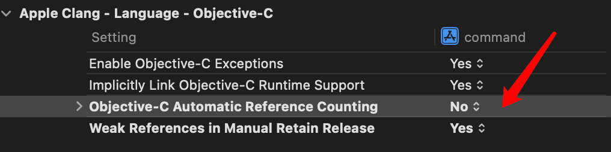

记录一些函数和语法。。。

## 一些基础C函数

### sleep

用于等待指定的秒数，在`unistd.h`中声明

### atoi

获取一个字符串后将它转换成整数，如果不能转换，就返回0。

```c
int num = atoi("23");
```

### modf

返回浮点数的整数部分和小数部分，整数部分通过引用传递。

```c
double pi = 3.14;
double integerPart;
double fractionPart = modf(pi, &integerPart);
printf("%.0f, %.2f\n", integerPart, fractionPart);
```

### time和localtime_r

`time`函数返回英国格林尼治时间从1970到当前累计时间。`localtime_r`函数可以读取当前秒数。`localtime_r`有两个形式参数，分别是time_t类型变量的地址和struct tm类型变量的地址。

```c
 long t = time(NULL);
 printf("%ld\n", t);
 struct tm now;
 localtime_r(&t, &now);
 printf("The time is %d:%d:%d\n", now.tm_hour, now.tm_min, now.tm_sec);
```

## OC部分

### import 指令

这是一个预处理指令，是include的增强版，将文件的内容在预编译的时候拷贝写指令的地方。同一个文件无论import多少次，只会包含一次。

### NSLog

printf增强版，用于输出一些调试信息。

- 执行这段代码的时间
- 程序的名称
- 进程编号
- 线程编号
- 输出的信息

### OC程序编译

使用编译器将源代码编译成目标文件

```shell
cc -cxx.m
```

- 预处理
- 检查语法
- 编译

链接

```shell
cc xx.o
```

如果程序中使用了框架中的函数或者类，那么在链接的时候，就必须要告诉编译器，去框架中寻找那个类。

```shell
cc xx.o -framework 框架名称
```

链接成功之后，会生成一个a.out可执行文件。

### 内存中的五大区域

- 栈 存储局部变量
- 堆 手动申请的字节空间 malloc、calloc、realloc
- BSS段 存储未被初始化或初始化为0的全局变量 静态变量
- Data段(常量段) 存储已经被初始化的全局、静态变量 常量数据
- 代码段 存储代码

### id

当声明指向对象的指针时，通常都会明确地写出相应对象的类：

```objc
NSDate *expiration;
```

当声明的指针不知道所指对象的准确类型时，可以使用id类型，id类型的含义是：可以指向任意类型Objective-C对象的指针。id已经隐含了星号的作用。

```objc
id delegate;
```

#### NSObject 和 id的区别

相同点：万能指针 都可以指向任意的oc对象

不同点： 通过NSObject指针去调用对象方法的时候，编译器会做编译检查。通过id类型去调用对象方法的时候，编译器会直接通过。

注意：id指针只能调用对象的方法，不能使用点语法，如果使用点语法就会直接编译错误。

### NSString

#### 创建字符串实例

```objc
NSString *lament = @"Why me?";
```

`@"..."`是OC中的一个缩写，代表根据给定的字符串创建一个`NSString`对象。这种缩写为字面量语法。

#### 创建动态字符串

```objc
NSString *dateStr = [NSString stringWithFormat: @"The date is %@", now];
```

#### NSString 方法

```objc
NSString *str = @"Hello World";
// 获取长度
NSUInteger count = [str length];
NSLog(@"%lu", count);
NSString *temp = @"123";
// 判断字符串是否相同
if([temp isEqualToString: str]) {
  NSLog(@"equal");
}
// 返回原字符串大写版本
NSString *upper = [str uppercaseString];
NSLog(@"%@", upper);

NSString* str = @"test\n123\n";
NSArray *array = [str componentsSeparatedByString:@"\n"];
for (NSString* str in array) {
  NSLog(@"%@", str);
}
```

### NSArray/NSMutableArray

创建NSArray，使用字面量语法。

```objc
NSDate *now = [NSDate date];
NSDate *tomorrow = [now dateByAddingTimeInterval:24.0*60.0*60.0];
NSDate *yesterday = [now dateByAddingTimeInterval:-24.0*60.0*60.0];
NSArray *dateList = @[now, tomorrow, yesterday];

NSLog(@"%@", dateList[0]);
// 获取数组中的元素个数
NSLog(@"%@", [dateList count]);
```

NSArray实例是无法改变的，一旦被创建，就无法添加或者删除。

创建NSMutableArray

```objc
NSMutableArray *dateList = [NSMutableArray array];
[dateList addObject: now];
[dateList addObject: tomorrow];
[dateList insertObject: yesterday atIndex: 0];
[dateList removeObjectAtIndex: 0];
```

#### 快速枚举

```objc
for (NSDate *d in dateList) {
    NSLog(@"%@", d);
}
```

### 类加载

- 当某个类第一次被访问时，会被加载到代码段，这个过程叫类加载
- 执行方法的4步：
  1. 将方法加载到代码段
  2. 声明方法的参数到栈
  3. 把实参的值赋值给形参

- 类一旦被加载到代码段之后，是不会被回收的，除非程序结束。

### 对象在内存中的存储

```objc
Person *p1 = [Person new];
```

1. Person *p1; 会在栈中申请一块空间。在栈内存中声明一个Person类型的指针变量p1。
2. [Person new]; 真正在内存中创建对象的是这句代码。new做了下面几件事情。

>1. 在堆内存中申请一块合适大小的空间。
>2. 在这个空间中根据类的模版创建对象。类模版中定义了哪些属性，就把这些属性依次声明在对象之中。对象中还有另外一个属性，叫做`isa`，是一个指针，它指向对象所属的类在代码段中的地址。
>3. 初始化对象的属性，如果属性的类型是基本数据类型，那么就赋值为0，如果属性的类型是C语言的指针类型，就赋值为NULL，如果属性的类型是OC的类指针类型，那么就赋值为nil。
>4. 返回对象的地址

注意事项

- 对象中只有属性，而没有方法，自己类的属性外加1个isa指针指向代码段中的类。
- 如何访问对象的属性
  指针名 -> 属性名
  根据指针，找到指针指向的对象，再找到对象中的属性类访问。
- 如何调用方法
  [指针名 方法名];
  先根据指针名找到对象，对象发现要调用方法，再根据对象的isa指针找到类，然后调用类里的方法。

### self

1. 当类第一次被访问时，会将类的代码存储在代码区，代码区中用来存储类的空间也有1个地址
2. 在类方法中，self也是一个指针，指向这个类在代码段中的地址，self在类方法中就相当于这个类
3. 可以查看isa指针的值，或者在类方法中查看self的值，调用对象的`class`方法，就会返回这个对象所属的类在代码段中的地址。调用类的`class`方法，也会返回这个类在代码段中的地址。
4. 可以在类中的类方法里通过self调用其他的类方法

#### 子类的存储

- 子类对象中有自己的属性和所有父类的属性
- 代码段中的每一个类都有一个`isa`指针，这个指针指向它的父类，一直指向`NSObject`。

### 类的本质

在代码段中存储类的步骤：

1. 先在代码段中创建1个Class对象，Class是Foundation框架中的1个类。这个Class对象就是用来存储类信息的。
2. 将类的信息存储在这个Class对象之中。这个Class对象至少有3个属性，类名:存储的这个类的名称，属性:存储的这个类具有哪些属性，方法:存储的这个类具有哪些方法。

所以。类是以Class对象的形式存储在代码段的。存储类的这个Class对象我们也叫做类对象。用来存储类的1个对象。所以，存储类的类对象也有1个叫做isa指针的属性这个指针指向存储父类的类对象.

```objc
Class c1 = [Person class];
NSLog(@"c1 = %p", c1);
        
Person *p = [Person new];
Class c2 = [p class];
NSLog(@"c2 = %p", c2);
```

- 调用类的类方法`class`，可以得到存储类的类对象的地址。
- 调用对象的对象方法 `class`，就可以得到存储这个对象所属的类的Class对象的地址。
- 对象中的isa指针的值其实就是代码段中存储类的类对象的地址。

**Class指针在typedef的时候已经加了\*，不需要在定义的时候加\*。**

#### 类对象的使用

使用类对象调用类的方法

只能调用类方法，因为类对象就等价于存在其中的类。

```objc
// c1就代表Person类
Class c1 = [Person class];
[Person sayHi];
[c1 sayHi];
```

使用类对象来调用`new`方法

```objc
Person *p1 = [Person new];
Class c1 = [Person class];
Person *p2 = [c1 new];
```

### 方法的本质

`SEL`全程叫做`selector`选择器，`SEL`是一个数据类型，需要在内存中申请空间存储数据。SEL其实是一个类，SEL对象用来存储一个方法的。

方法的存储：

1. 先创建1个SEL对象
2. 将方法的信息存储在这个SEL对象之中
3. 再将这个SEL对象作为类对象的属性

```objc
SEL fun = @selector(sayHi);
NSLog(@"sel = %p", fun);
```

方法的调用

```objc
[Person sayHi];
```

1. 先拿到存储sayHi方法的SEL对象，也就是拿到存储sayHi方法的SEL数据，SEL消息。
2. 将这个SEL消息发送给p1对象
3. 这个时候，p1对象接收到这个SEL消息以后就要调用的方法。
4. 根据对象的isa指针找到存储类的类对象
5. 找到这个类以后，在这个类对象中去搜索是否有和传入的SEL数据相匹配的。如果有就执行，如果没有再找父类，直到NSObject。

OC最重要的机制，消息机制，调用方法的本质其实是为对象发送SEL对象。

#### 手动为对象发送消息

1. 先得到SEL数据
2. 将这个SEL消息发送给p1对象
3. 调用对象的`performSelector`方法，结果和`[p sayHi]`一致。

```objc
Person *p = [Person new];
[p sayHi];
[p performSelector:fun];
```

带参数函数调用

```objc
SEL fun = @selector(setName:);
Person *p = [Person new];
NSString *name = @"jack";
[p performSelector:fun withObject: name];
NSLog(@"name = %@", [p name]);
```

### instancetype

```objc
+ (instancetype) person {
    return [self new];
}
```

instancetype只能作为方法的返回值，不能在别的地方使用。如果写成具体的类型，那么子类集成时，返回的就是父类的指针。

### isKindOfClass / isMemberOfClass

```objc
+ (BOOL)respondsToSelector:(SEL)aSelector; // 判断对象中是否有这个方法可以执行
+ (BOOL)instancesRespondToSelector:(SEL)aSelector; // 判断类中是否有指定的类方法
- (BOOL)isKindOfClass:(Class)aClass; // 判断是否是某类的对象或子类对象
- (BOOL)isMemberOfClass:(Class)aClass; // 判断是否是某类的对象，不包括子类对象
```

### 构造方法

`new`方法的内部，其实是先调用的`alloc`方法，再调用`init`方法。

```objc
Person *p1 = [Person new];
Person *p2 = [[Person alloc] init];
```

`init`方法：

初始化对象，为对象的属性赋初始值，这个`init`方法我们叫做构造方法。

#### 重写`init`方法的规范

1. 必须先调用父类的init方法，然后将方法的返回值赋值给self
2. 调用init方法可能会失败，如果初始化失败，返回的是nil
3. 如果初始化成功，基于初始化当前对象的属性
4. 最后返回self的值

```objc
- (instancetype) init 
{
  self = [super init];
  if (self != nil) {
    self.name = @"jack";
  }
  return self;
}
```

#### 自定义构造方法

```objc
- (instancetype) initWithName: (NSString *)name andAge:(int) age 
{
  if (self = [super init]) {
    self.name = name;
    self.age = age;
  }
}
```

### 内存管理

栈：局部变量，当局部变量的作用域被执行完毕之后，这个局部变量就会被系统立即回收。

堆：内存管理

BSS段：未初始化的全局变量、静态变量，一旦初始化就回收，并转存到数据段中。

数据段：已经初始化得到全局变量、静态变量，直到程序结束才会被回收

代码段：代码、程序结束的时候，系统会自动回收存储在代码段中的数据。

栈、BSS段、数据段、代码段中的数据，都是由系统自动完成回收。

#### 引用计数

每一个对象都有1个属性，叫做`retainCount`，类型是unsigned long 占8个字节。引用计数器的作用，用来记录当前这个对象有多少个人在使用。默认情况下，创建一个对象出来，它的计数器默认为1。当这个对象的引用计数器变为0时，系统会自动回收这个对象。

```objc
Person *p = [[Person alloc] init];
NSLog(@"count = %lu", [p retainCount]); // count = 1
```

具体操作：

- 当对象发送一条retain消息，对象的引用计数器就会加1
- 当对象发送1条release消息时，对象的引用计数器减1
- 当对象的引用计数器变为0的时候，对象会被系统立即回收，在被回收的时候，会被调用对象的dealloc方法

内存管理分为`MRC`和`ARC`。

MRC：Manual Referen Counting 手动引用计数

ARC：Automatic Reference Counting 自动引用计数

### MRC

默认开启ARC，需要将Build Setting中的ARC关闭之后，才能使用MRC。具体操作见下图。



实现一下类的`dealloc`方法。

```objc
- (void)dealloc {
    NSLog(@"dealloc");
    [super dealloc];
}
```

在主函数中调用相关方法。

```objc
Person *p = [[Person alloc] init];
NSLog(@"count = %lu", [p retainCount]); // count = 1
[p retain];
NSLog(@"count = %lu", p.retainCount); // count = 2
[p release];
[p release];
// dealloc
```

`release`消息并不是回收对象，而是让对象的引用计数器-1，当引用计数器为0的时候，才会回收对象。回收只是意味着对象所占用的空间可以分配给别人，但是空间里存储的数据还在。

```objc
Person *p = [[Person alloc] init];
[p release]; // retainCount = 0, dealloc
[p sayHi]; // 可能还可以正常运行
```

#### 野指针和僵尸对象

OC中的野指针：指针指向的对象已经回收了，这样的指针叫做野指针。

僵尸对象：1个已经释放的对象，但是这个对象所占的空间还没有分配给别人，这样的对象叫做僵尸对象。

当我们通过野指针去访问僵尸对象的时候，有可能有问题，也有可能没有问题。

当僵尸对象占用的空间分配给了别人使用的时候，就不可以。

#### 内存泄漏

指的是1个对象没有被及时的回收，在该回收的时候而没有被回收，一直驻留在内存中，直到程序结束的时候才回收。

单个对象内存泄漏的情况：

- 有对象创建，没有对应的release
- retain和release的次数不匹配
- 在不适当的时候，为指针赋值为 nil
- 在方法当中为传入的对象进行不适当的retain

如何确保单个对象可以被回收：

- 有对象的创建，就必须要匹配1个release
- retain次数和release次数一定要匹配
- 只有在指针称为野指针的时候才能赋值为nil
- 在方法当中不要随意为传入的对象retain

#### OC属性

```objc
@property (nonatomic, retain) NSString *name;
@property (nonatomic, assign) int age;
```

- assign: 默认值，生成的setter方法的实现就是直接赋值
- retain：生成的setter方法的实现是标准的MRC内存管理代码，也就是，先判断新旧对象是否为同1个对象，如果不是，release旧的，retain新的。

当属性的类型是oc对象类型的时候，使用retain，否则用assign

注意:

retain参数，只是生成标准的setter方法为标准的MRC内存管理代码，不会自动的在dealloc中生成release方法，所以我们还要自己手动在dealloc中release。

readwrite和readonly

readwrite是默认值，代表同时生成getter、setter

readonly：只会生成getter

```objc
@property (nonatomic, assign, getter=xxx, setter=xyz) int age; // 指定getter setter方法名
```

##### 自动释放池

存入自动释放池中的对象，在自动释放池被销毁的时候，会自动调用存储在该自动释放池中的所有对象的release。

### ARC

在ARC机制下，当没有任何类型的强指针指向对象的时候，这个对象就会被立即回收。

- 指向对象的强指针被回收
- 指向对象的强指针被赋值为nil

在ARC下，property不可以添加retain参数，属性默认是strong。

### 分类

- 在分类中可以写@property，但是不会自动生成私有属性，也不会自动生成getter、setter的实现，只会生成getter、setter的声明，需要自行实现

- 在分类的方法实现中不可以直接访问本类的真私有属性（定义在implementation中），但是可以调用本类的getter、setter来访问属性
- 当分类中有和本类同名的方法的时候，优先调用分类的方法，哪怕没有引入分类的文件，如果多个分类中有同名的方法，那么会调用最后编译的。

```objc
@interface Person (grow)

@end
```

### 延展

```objc
@interface Person ()

@end
```

本质上是一个分类，作为本类的一部分，只有声明，没有单独的实现，和本类共享一个对象。

延展和分类的区别：

- 分类有名字，延展没有，是一个匿名的分类
- 每一个分类都有单独的声明和实现，而延展只有声明，没有单独的实现，和本类共享一个实现
- 分类中只能新增方法，而延展中任意的成员都可以写
- 分类中可以写@property，但是只会生成getter、setter的声明，延展中写@property会自动生成私有属性，也会生成getter、setter

使用场景：

- 要为类写一个私有的@property，生成的getter、setter方法只有在类的内部访问，不能在外部访问
- 延展100%不会独占1个文件，都是将延展写在本类的实现文件中。这个时候，写在延展中的成员，就相当于这个类的私有成员，只能在本类的实现中访问。
- 将私有方法声明在延展中，在本类中实现，提高代码的阅读性
- 如果类的成员只希望在类内部访问，定义在延展中，希望在外部访问的话，定义在@interface中

### block

block是一个数据类型，block类型的变量中专门存储1段代码，这段代码可以有参数，也可以有返回值

```objc
void (^myblock) (void) = ^{
    NSLog(@"myblock");
};
int (^myblock1) (void) = ^int {
    NSLog(@"myblock1");
    return 1;
};
int (^myblock2) (int, int) = ^int(int num1, int num2) {
    return num1 + num2;
};
```

可以使用typedef来简化block的声明。

```objc
typedef void (^VoidBlock) (void);
VoidBlock v = ^void {
  NSLog(@"myblock");
};
```

获取/修改外部变量

- 在block中可以获取外部局部变量和全局变量的值
- 在block代码内部可以修改全局变量的值，但是不能外部局部变量的值
- 给局部变量添加`__block`修饰符，就可以在block中修改

```objc
__block int num = 0;
int (^myblock2) (int num1, int num2) = ^int(int num1, int num2) {
  num++;
  return num1 + num2;
};
```

block作为函数参数

```objc
typedef void (^VoidBlock) (void);
void test(VoidBlock testBlock) {
    testBlock();
}

test(^{
  NSLog(@"Hello");
});
```

block作为函数返回值

```objc
VoidBlock fun() {
  VoidBlock res = ^{
    NSLog(@"Hello World");
  }
  return res;
}
```

