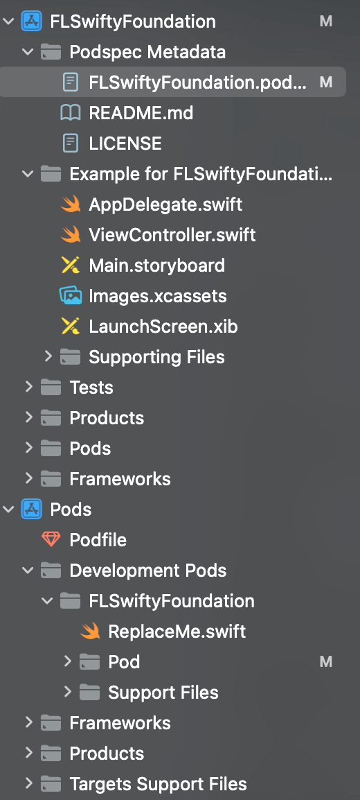

## 注册 CocoaPods 账号

首先需要检查自己是否注册过 CocoaPods 账号

```shell
pod trunk me
```

如果出现`[!] You need to register a session first.`这个提示，说明需要注册账号。

使用以下命令进行注册

```shell
pod trunk register email username
```

执行后会收到一封邮件，点击邮件中的链接跳转后，就注册成功了。可以再次使用`pod trunk me`进行验证。

## 创建 Pod 库项目文件

```shell
pod lib create FLSwiftyFoundation
```

根据提示选择 Platform、language 等信息。记得 demo Application 那一项要选 yes。

之后会自动使用 Xcode 打开工程。



项目目录如下，其中库文件在 Pods/Development Pods 下面。

## 修改并验证配置文件

```ini
s.name = "xxxx" #库的名字
s.version = "0.0.1" #版本号，当私有库需要更新的时候只要修改这个值
s.summay = "xxxxxx" #库的简介，pod search 显示在上面的介绍
s.description = "xxxxxxxx" #库的详细描述
s.homepage = "https://xxxx" #主页地址，pod search 会显示，一般填写仓库的地址就行了
s.license = { :type => 'MIT', :file => 'LICENSE' } #开源协议，项目文件目录下需要有一个MIT开源协议文件，创建的时候默认就创建了这个，具体内容可以打开 LICENSE 查看
s.author = { "name" => "xxxxxx@qq.com" } #作者名字、邮箱
s.ios.deployment_target = '9.0' #库最低支持的系统版本
s.swift_version = '5.0' # swift版本
s.source = { :git => "https://github.com/GavinKangDeveloper/KKPodTest.git", :tag => "#{s.version}" } #资源地址，pod install 的时候会根据这个地址去下载你的想要库，以及下载的版本，必须要跟s.version一致。
s.source_files = "xxxx" #这个很重要，指定资源文件，前缀就是 .podspec 文件当前路径，只用写之后的路径，如 Classes/* 是指 Classes 文件夹下的所有文件，但不包括子文件夹里面的文件、Classes/**/* 是指包含所有 Classes 文件夹下的文件，包括子文件、Classes/**/*.{h,m} 是指包含所有 Classes 文件夹下的后缀为 .h 和 .m 的文件，也可以指定文件。
s.requires_arc = true #是否支持arc

>>>>>以下是可选描述<<<<<
s.resource_bundles = {
  'FLSwiftyFoundation' => ['FLSwiftyFoundation/Assets/*.png']
} #资源图片
# s.dependency "JSONKit", "~> 1.4" #需要依赖的三方库
#s.framework  = "SomeFramework" #需要依赖的框架
#s.public_header_files = '' #公开的头文件，如果没有公开，用户在用的时候可能引不到响应的头文件
s.subspec 'subFolder' do |ss|
    ss.source_files = 'Classes/xxx/**/*.{h,m}'
    ss.public_header_files = "Classes/xxx/**/*.{h}"
end   #这个是子依赖库，如果我们只是用 s.source_files 来指定文件，那么用户在 pod 下来之后所有的文件都在同一个目录下，没有子文件夹，如果想要分类，用 s.subspec，每一个 subspec 可以分一个子文件夹，但是记得一定要将 .h 文件通过 ss.public_header_files 公开，不然有可能会找不到头文件。
```

使用以下命令对配置文件进行验证

```ini
pod lib lint
```

## 将代码提交 Git 并进行本地测试

首先得 Git 三板斧提交本地文件到 github 仓库 , 因为 podspec 文件中获取 Git 版本控制的项目还需要 tag 号，所以我们还需要打上一个 tag

```shell
git tag -m 'First Release' '0.0.1'
git push --tags
```

之后进行本地测试，测试项目的 Podfile 如下：

```ruby
platform :ios, '11.0'

target 'FLSwiftyFoundation_Example' do
  pod 'FLSwiftyFoundation', :git => 'https://github.com/xxx/xxx.git'
end
```

## 提交组件到 Pod 以及后续升级操作

```shell
pod trunk push FLSwiftyFoundation.podspec --allow-warnings
```

后续要进行版本升级的时候，可以按照以下步骤来：

1. 修改升级的内容
2. 更改 podspec 里面的版本号
3. 把修改的内容全部推送到 Git 仓库
4. git tag 打标签
5. git push --tags
6. 推送到 pod

## 删除指定版本

本地删除

```shell
git tag -d '0.0.4'
git push --tags
```

pod 删除

```shell
pod trunk delete FLSwiftyFoundation 0.0.4
```

## 创建 Pod 私有库

### 创建 Spec Repo

创建远程 Spec Repo，创建完成后需要添加到本地。

```shell
pod repo add [私有库索引名字] [远程私有索引库地址]

# pod repo add TTSpecs https://gitee.com/tengteng_fan/tt_-spec
```

查看/移除本地已经关联的 repo

```shell
pod repo list

pod repo remove SpecName
```

将本地创建好的 pod 库提交到远程索引库

```shell
pod repo push [Spec仓库名] [私有库索引文件名(.podspec)]
```

这个命令有一些参数：

- 忽略警告在后面添加`--verbose --allow-warnings`
- 如果添加第三方库并包含静态包时需使用`--use-libraries`
- 采用 CTMediator 组件化时刻，Swift 发布组件需带上`--use-modular-headers`

例如：

```shell
pod repo push PrivatePod KJCategories.podspec --verbose --allow-warnings --use-libraries --use-modular-headers
```

Podspec 参数说明：

```shell
--help      显示指定命令的帮助横幅
--verbose   显示更多调试信息
--silent    显示所有信息
--allow-warnings   忽略警告
--use-libraries    使用静态库安装
--use-modular-headers       OC与Swift混编必须添加
--skip-import-validation    跳过验证pod是否可以导入
--skip-tests     在验证期间跳过构建和运行测试
--use-json       在将其推送到repo之前，将podspec转换为JSON
--swift-version=VERSION     在标记规范时应该使用的SWIFT_VERSION.这优先于规范中指定的Swift版本或. Swift版本文
```

成功之后更新索引

```shell
pod setup
```
