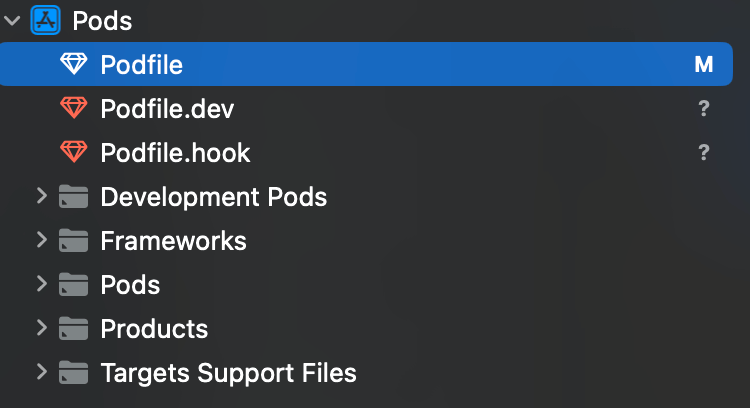

## Podfile 拆分

随着业务不断迭代，代码急剧膨胀，我们往往会对项目中的部分业务模块进行组件化的拆分，对底层的业务基础库做封装，项目的 Podfile 也会变得异常臃肿。其实可以根据 Pod 的类型，将 Podfile 拆到各个子文件中，例如 `Podfile.foundation`、`Podfile.business`这种。只需要把 pod 按照分类放到项目里的不同类型文件下，并在 Podfile 中读取相关的文件即可。

```ruby
# Podfile
target 'TokenCourse' do
  use_frameworks!
  # 读取Podfile.foundation里的内容
  eval(File.open('Podfile.foundation').read) if File.exist? 'Podfile.foundation'
  # ...
end


# Podfile.foundation
pod 'RxSwift', '6.5.0'
pod 'RxCocoa', '6.5.0'
```

### 添加相关文件到 Xcode 工程中

但是在`pod install`的时候，这些带后缀的 Podfile 并不会在 xcode 中显示，每次都需要手动添加并设置文件类型。其实 CocoaPods 有提供一个 Hook 函数`post_install`，它允许我们在项目被写入硬盘之前做一些事情。我们可以在这里将自定义的 Podfile 文件添加到项目中，并设置文件类型为 ruby 脚本。

```ruby
post_install do |installer|
  # 在生成的 pods.xcodeproj 中添加文件 Podfile.*相关文件
  # 不添加Podfile.lock
  file_paths = Dir.glob(File.join(File.dirname(__FILE__), "Podfile.*")).reject{|f| f.end_with?('.lock')}
  file_paths.each do |file_path|
     file_reference = installer.pods_project.new_file(file_path)
     # 设置文件类型为ruby脚本
     file_reference.set_explicit_file_type('text.script.ruby')
  end
  installer.pods_project.save
end
```



感觉把这部分放到一个 CocoaPods 插件里会更合适 🤔️。

## Pod 修改优化

在开发的时候，我们常常会对干这样的事情，将依赖的远程 pod 改为本地的 pod，来对它进行修改。

```ruby
# pod 'UniFoundation', '~> 0.0.3'
pod 'UniFoundation', :path => '../UniFoundation'
```

每次还要找到对应的 pod 写在哪里，尤其是当有些 pod 是其他库引入的时候，就更麻烦了。例如我们在 `AppModule`这个库中引入了`Yams`这个库。

```ruby
Pod::Spec.new do |s|
  s.name             = 'AppModule'
  s.version          = '0.0.1'
  # ...
  s.dependency 'Yams', '~> 4.0'
end
```

当我们想在本地去改`Yams`这个库，而不去改`AppModule`的话，就会发生这样的状况。

```ruby
# Podfile
pod 'AppModule'
# 本地开发
pod 'Yams', :path => '../Yams'
```

执行`pod install`的时候，会出现下面的报错。

```shell
[!] CocoaPods could not find compatible versions for pod "Yams":
  In Podfile:
    AppModule was resolved to 0.0.1, which depends on
      Yams (~> 4.0)

    Yams (from `../Yams`)
```

非常烦 😭，要是能在安装依赖的时候，自动替换成下面这个本地路径的就好了。首先 Hook 函数是做不到的，`pre_install` 和 `post_install`两个 Hook 函数，分别对应 Pods 工程安装前和安装后，我们这里属于是在 Analyze 阶段就 🐔 了。

### CocoaPods 源码分析

这里看了一篇字节技术团队的文章[《抖音研发效能建设 - CocoaPods 优化实践？》](https://mp.weixin.qq.com/s/Pt6pcxKCHhdnnWPYrToNvA)，讲解了 CocoaPods 的`pod install`的整个流程。

通过查看 analyzer 里的依赖数据流向，找到了下面的这个方法。里面调用了 target_definition.dependencies 来获取了相关的依赖。

```ruby
def self.from_podfile(podfile)
  raise ArgumentError, 'Must be initialized with a podfile' unless podfile
  podfile_dependencies = []
  dependencies_by_target_definition = {}
  podfile.target_definition_list.each do |target_definition|
    # 获取依赖
    deps = target_definition.dependencies.freeze
    podfile_dependencies.concat deps
    dependencies_by_target_definition[target_definition] = deps
  end
  podfile_dependencies.uniq!

  new(podfile_dependencies.freeze, dependencies_by_target_definition.freeze)
end
```

dependencies 方法定义在`Pod::Podfile::TargetDefinition`这个类里。

```ruby
# @return [Array<Dependency>] The list of the dependencies of the target
#         definition including the inherited ones.
#
def dependencies
  if exclusive?
    non_inherited_dependencies
  else
    non_inherited_dependencies + parent.dependencies
  end
end
```

### dependencies 方法替换

在 Ruby 中，我们可以使用`alias_method`将一个方法的名称从一个类中移除，并将其替换为另一个方法的名称。这里对 dependencies 方法进行下重写，将返回的 Array 里本地开发的 pod 给替换掉。

首先，定义了一个 Hash 用于存储，key 为 pod 的 name，value 为 `Dependency`。

```ruby
# 存储所有override的pod信息，key为name
$override_hash = Hash.new

def override_pod(name, *requirements)
  puts "Override Pod #{name}".yellow

  $override_hash[name] = Pod::Dependency.new(name, *requirements)
  pod name, *requirements
end
```

再替换一下 dependencies 方法。

```ruby
class Pod::Podfile::TargetDefinition

  # 覆盖原有的dependencies方法
  # https://www.rubydoc.info/github/CocoaPods/Core/master/Pod/Podfile/TargetDefinition#dependencies-instance_method
  alias_method :origin_dependencies, :dependencies

  def dependencies
    deps = origin_dependencies.map { |it| $override_hash.has_key?(it.name) ? $override_hash[it.name] :it }
    return deps
  end

end
```

## 参考文章

https://www.rubydoc.info/github/CocoaPods/Core/master/Pod/Specification/Consumer#dependencies-instance_method
