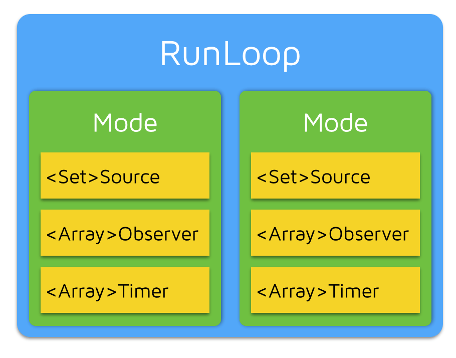

## RunLoop 介绍

运行循环，在程序运行过程中，循环做一些事情。应用范畴：定时器(Timer)、performSelector、GCD Async Main Queue、事件响应、手势识别、界面刷新、网络请求、AutoreleasePool 等等。

伪代码：

```objc
int main(int argc, char * argv[]) {
    @autoreleasepool {
        int retVal = 0;
        do {
            int message = sleep_and_wait();
            retVal = process_message(message);
        } while (retVal == 0);
    }
    return 0;
}
```

有了 RunLoop 之后，程序不会马上退出，而是保持运行状态。RunLoop 的基本使用：

-   保持程序的持续运行
-   处理 App 中的各种事件（比如触摸事件、定时器事件等）
-   节省 CPU 资源，提高程序性能：该做事时做事，该休息时休息

## RunLoop 对象

iOS 中有 2 套 API 来访问和使用 RunLoop

-   Foundation：NSRunLoop
-   Core Foundation：CFRunLoopRef

NSRunLoop 和 CFRunLoopRef 都代表着 RunLoop 对象，NSRunLoop 是基于 CFRunLoopRef 的一层 OC 包装。CFRunLoopRef 是开源的，https://opensource.apple.com/tarballs/CF/

```objc
NSRunLoop *runloop = [NSRunLoop currentRunLoop];

CFRunLoopRef runloop = CFRunLoopGetCurrent();

//获取主线程 runloop
NSRunLoop *mainRunLoop = [NSRunLoop mainRunLoop];
```

## RunLoop 与线程

-   每条线程都有唯一的一个与之对应的 RunLoop 对象
-   RunLoop 保存在一个全局的 Dictionary 里，线程作为 key，RunLoop 作为 value
-   线程刚创建时并没有 RunLoop 对象，RunLoop 会在第一次获取它时创建
-   RunLoop 会在线程结束时销毁
-   主线程的 RunLoop 已经自动获取（创建），子线程默认没有开启 RunLoop

## RunLoop 实现

```objc
struct __CFRunLoop {
    pthread_t _pthread;
    uint32_t _winthread;
    CFMutableSetRef _commonModes;
    CFMutableSetRef _commonModeItems;
    CFRunLoopModeRef _currentMode;
    CFMutableSetRef _modes;
    // ...
};

struct __CFRunLoopMode {
    CFStringRef _name;
    Boolean _stopped;
    char _padding[3];
    CFMutableSetRef _sources0;
    CFMutableSetRef _sources1;
    CFMutableArrayRef _observers;
    CFMutableArrayRef _timers;
    //...
};
```



CFRunLoopModeRef 代表 RunLoop 的运行模式，一个 RunLoop 包含若干个 Mode，每个 Mode 又包含若干个 Source0/Source1/Timer/Observer。RunLoop 启动时只能选择其中一个 Mode，作为 currentMode，如果需要切换 Mode，只能退出当前 Loop，再重新选择一个 Mode 进入。不同组的 Source0/Source1/Timer/Observer 能分隔开来，互不影响。如果 Mode 里没有任何 Source0/Source1/Timer/Observer，RunLoop 会立马退出。

常见的 2 种 Mode：

-   kCFRunLoopDefaultMode（NSDefaultRunLoopMode）：App 的默认 Mode，通常主线程是在这个 Mode 下运行

-   UITrackingRunLoopMode：界面跟踪 Mode，用于 ScrollView 追踪触摸滑动，保证界面滑动时不受其他 Mode 影响

Source0:

-   触摸事件处理
-   performSelector:onThread:

Source1:

-   基于 port 的线程间通信
-   系统事件捕捉

点击事件实际是通过 source1 捕捉，然后再包装成 source0 来处理的。（可以阅读[《深入理解 iOS 事件机制》](https://juejin.cn/post/6844903905080410125)）

Timers：

-   NSTimer
-   performSelector:withObject:afterDelay:

Observers：

-   用于监听 RunLoop 的状态
-   UI 刷新（BeforeWaiting）
-   AutoreleasePool 处理（BeforeWaiting）

## RunLoop Observer

```objc
- (void)dealloc {
    if (runLoopObserver != NULL) {
        CFRunLoopRemoveObserver(CFRunLoopGetMain(), runLoopObserver, kCFRunLoopDefaultMode);
        CFRelease(runLoopObserver);
        runLoopObserver = NULL;
    }
}

- (void)startObserving {
    if (runLoopObserver != NULL) {
        return;
    }

    CFRunLoopObserverContext context = {
        0, (__bridge void *)self, NULL, NULL, NULL
    };
    runLoopObserver = CFRunLoopObserverCreate(kCFAllocatorDefault,
kCFRunLoopAllActivities, true, 0, &runLoopObserverCallback, &context);

    CFRunLoopAddObserver(CFRunLoopGetMain(), runLoopObserver, kCFRunLoopDefaultMode);

    NSLog(@"RunLoop 观察者已添加");
}

// 观察者回调函数
void runLoopObserverCallback(CFRunLoopObserverRef observer, CFRunLoopActivity activity, void *info) {
    switch (activity) {
        case kCFRunLoopEntry:
            NSLog(@"RunLoop Entry");
            break;

        case kCFRunLoopBeforeTimers:
            NSLog(@"RunLoop Before Timers");
            break;

        case kCFRunLoopBeforeSources:
            NSLog(@"RunLoop Before Sources");
            break;

        case kCFRunLoopBeforeWaiting:
            NSLog(@"RunLoop Before Waiting");
            break;

        case kCFRunLoopAfterWaiting:
            NSLog(@"RunLoop After Waiting");
            break;

        case kCFRunLoopExit:
            NSLog(@"RunLoop Exit");
            break;

        default:
            break;
    }
}
```

RunLoop 的运行逻辑：

1.  通知 Observers：进入 Loop
2.  通知 Observers：即将处理 Timers
3.  通知 Observers：即将处理 Sources
4.  处理 Blocks（CFRunLoopPerformBlock 添加
5.  处理 Source0（可能会再次处理 Blocks）
6.  如果存在 Source1，就跳转到第 8 步处理 Source1
7.  通知 Observers：开始休眠（等待消息唤醒）
8.  通知 Observers：结束休眠（被某个消息唤醒）

    -   处理 Timer
    -   处理 GCD Async To Main Queue
    -   处理 Source1

9.  处理 Blocks
10. 根据前面的执行结果，决定如何操作

    -   回到第 02 步
    -   退出 Loop

11. 通知 Observers：退出 Loop

补充：RunLoop 和 GCD

一般来说 GCD 和 RunLoop 是各管各的，但是如果 GCD 中使用了 dispatch_async(dispatch_get_main_queue(), block)，那么 GCD 会将 block 放到主线程的 RunLoop 中执行。

```objc
dispatch_async(dispatch_get_main_queue(), ^{
    NSLog(@"1");
});
```

补充：休眠

RunLoop 休眠是使用内核层面的 API mach_msg() 来实现的。在用户态调用 mach_msg() 会进入内核态，内核态会调用 mach_msg_trap() 来处理消息。mach_msg_trap() 会检查是否有消息，如果有消息，就会唤醒线程。

## Timer

```objc


NSTimer *timer = [NSTimer timerWithTimeInterval:1.0 repeats:YES block:^(NSTimer * _Nonnull timer) {
    NSLog(@"Timer");
}];

// NSDefaultRunLoopMode、UITrackingRunLoopMode 才是真正存在的模式
// NSRunLoopCommonModes 并不是一个真实的模式，它只是一个标记，表示在 RunLoop 结构中的CFMutableSetRef _commonModes里存放的所有模式

[[NSRunLoop currentRunLoop] addTimer:timer forMode:NSRunLoopCommonModes];

// 运行在 RunLoop 的默认模式下，在列表滚动时（UITrackingRunLoopMode），会停止计时。
[NSTimer scheduledTimerWithTimeInterval:1.0 repeats:YES block:^(NSTimer * _Nonnull timer) {
    NSLog(@"Timer");
}];
```

## 线程保活

必须要往 RunLoop 里添加 source/timer/observer，否则线程会退出。

```objc
    NSThread *thread = [[Thread alloc] initWithBlock:^{
        NSLog(@"%@", [NSThread currentThread]);

        // 往 RunLoop 里添加 source/timer/observer
        [[NSRunLoop currentRunLoop] addPort:[NSPort new] forMode:NSDefaultRunLoopMode];
        [[NSRunLoop currentRunLoop] run];
    }];

    [thread start];
```

这样写的话，这个线程会一直运行，可以使用 performSelector:onThread: 来唤醒线程。

```objc
// 参数：
// aSelector：方法
// thread：线程
// object：参数
// waitUntilDone：是否等待线程执行完毕，为 true 的话会等待
[self performSelector:@selector(run) onThread:thread withObject:nil waitUntilDone:NO];

- (void)run {
    NSLog(@"run");
}
```

在创建线程的时候，有可能导致循环引用，例如：

```objc
@interface ViewController ()

@property (nonatomic, strong) NSThread *thread;

@end
@implementation ViewController
- (void)viewDidLoad {
    [super viewDidLoad];

    // self 强引用了 thread，thread 又强引用了 self，导致循环引用
    self.thread = [[NSThread alloc] initWithTarget:self selector:@selector(run) object:nil];
    [self.thread start];
}

- dealloc {
    // dealloc 方法不会被调用
    NSLog(@"dealloc");
}

- (void)run {
    NSLog(@"run");

    [[NSRunLoop currentRunLoop] addPort:[NSPort new] forMode:NSDefaultRunLoopMode];
    [[NSRunLoop currentRunLoop] run];
}
```

可以使用 block 来解决这个问题：

```objc
self.thread = [[NSThread alloc] initWithBlock:^{
    NSLog(@"%@", [NSThread currentThread]);
    [[NSRunLoop currentRunLoop] addPort:[NSPort new] forMode:NSDefaultRunLoopMode];
    [[NSRunLoop currentRunLoop] run];
}];
[self.thread start];
```

在修改为 block 之后，我们会发现控制器可以正常释放了，但是线程并没有退出，这是因为我们开启了 RunLoop，RunLoop 会一直运行，线程不会退出。

停止子线程的 RunLoop：

首先，不能使用[[NSRunLoop currentRunLoop] run]，而是使用[[NSRunLoop currentRunLoop] runMode:NSDefaultRunLoopMode beforeDate:[NSDate distantFuture]]。因为 run 方法是无法停止的，它专门用来开启一个永不销毁的线程。

```objc

@interface ViewController ()

@property (nonatomic, strong) NSThread *thread;

@end
@implementation ViewController
- (void)viewDidLoad {
    [super viewDidLoad];

    // self 强引用了 thread，thread 又强引用了 self，导致循环引用
    self.thread = [[NSThread alloc] initWithBlock:^{
        NSLog(@"%@", [NSThread currentThread]);
        [[NSRunLoop currentRunLoop] addPort:[NSPort new] forMode:NSDefaultRunLoopMode];
        [[NSRunLoop currentRunLoop] runMode:NSDefaultRunLoopMode beforeDate:[NSDate distantFuture]];
    }];
    [self.thread start];
}

- dealloc {
    // dealloc 方法不会被调用
    NSLog(@"dealloc");
}

- (void)touchesBegan:(NSSet<UITouch *> *)touches withEvent:(UIEvent *)event {
    NSLog(@"%s", __func__);
    // 调用 test 方法，调用之后会发现线程会退出，但是我们没有调用 stopRunLoop 方法，为什么线程会退出呢？
    [self performSelector:@selector(test) onThread:self.thread withObject:nil waitUntilDone:NO];
}

- (void)test {
    NSLog(@"test");
}

- (void)run {
    NSLog(@"run");

    [[NSRunLoop currentRunLoop] addPort:[NSPort new] forMode:NSDefaultRunLoopMode];
    [[NSRunLoop currentRunLoop] run];
}

- (void)stopRunLoop {
    // 停止子线程的 RunLoop
    [[NSRunLoop currentRunLoop] performSelector:@selector(stop) onThread:self.thread withObject:nil waitUntilDone:NO];
}

- (void)stop {
    [[NSRunLoop currentRunLoop] stop];
}
```

在点击屏幕之后，会发现线程会退出，但是我们没有调用 stopRunLoop 方法，为什么线程会退出呢？

因为我们是使用 runMode 的方式开启 RunLoop，这种情况下，RunLoop 在执行完一次任务之后，就会退出。 可以通过添加一个状态变量来控制 RunLoop 的停止。

```objc
@property (nonatomic, assign, getter=isStopped) BOOL stopped;

- dealloc {
    // waitUntilDone 一定要设置为 YES，不然子线程会在控制器销毁之后还访问 self，导致 BAD ACCESS，触发崩溃
    [self performSelector:@selector(stop) onThread:self.thread withObject:nil waitUntilDone:YES];
}


// 注意：weakSelf.isStopped 在 self 是 nil 的时候，会返回 NO，会导致循环还在一直执行
// 不要使用 StrongSelf，那样会导致循环引用
while (weakSelf && !weakSelf.isStopped) {
    [[NSRunLoop currentRunLoop] runMode:NSDefaultRunLoopMode beforeDate:[NSDate distantFuture]];
}
// ...


- (void)stop {
    self.stopped = YES;

    CFRunLoopStop(CFRunLoopGetCurrent());
}
```

整体上还是比较麻烦，其实直接使用 CFRunLoop 相关的 API 可以简单实现。

```objc
// 实现了保活的线程封装
@interface Thread ()
@property (nonatomic, strong) NSThread *innerThread;
@end

@implementation Thread

- (void)dealloc
{
    [self stop];
}

- (void)run {
    if (!self.innerThread) {
        __weak typeof(self) weakSelf = self;
        self.innerThread = [[NSThread alloc] initWithBlock:^{
            CFRunLoopSourceContext context = {0};
            // 创建 source
            CFRunLoopSourceRef source = CFRunLoopSourceCreate(kCFAllocatorDefault, 0, &context);
            CFRunLoopAddSource(CFRunLoopGetCurrent(), source, kCFRunLoopDefaultMode);
            CFRelease(source);
            // 最后一个参数returnAfterSourceHandled，设置为 false 就不会退出
            CFRunLoopRunInMode(kCFRunLoopDefaultMode, DBL_MAX, false);
        }];
    }
    [self.innerThread start];
}

- (void)executeTask:(ThreadTask)task {
    NSAssert(self.innerThread != nil, @"thread is nil，please make sure call run method first");
    NSAssert(task != nil, @"task is nil");
    [self performSelector:@selector(__executeTask:) onThread:self.innerThread withObject:task waitUntilDone:NO];
}

- (void)stop {
    if (!self.innerThread) {
        return;
    }
    [self performSelector:@selector(__stopRunLoop) onThread:self.innerThread withObject:self waitUntilDone:YES];
}

// MARK: Private

- (void)__executeTask:(ThreadTask)task {
    task();
}

- (void)__stopRunLoop {
    CFRunLoopStop(CFRunLoopGetCurrent());
    self.innerThread = nil;
}

@end
```
