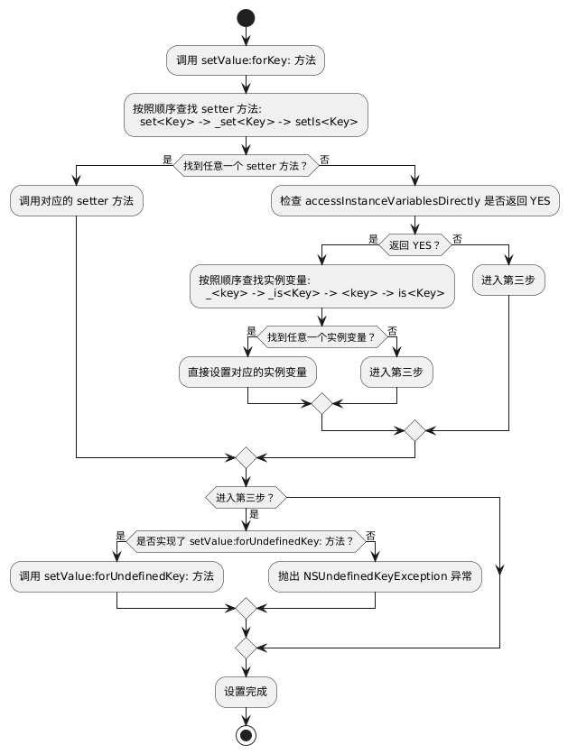
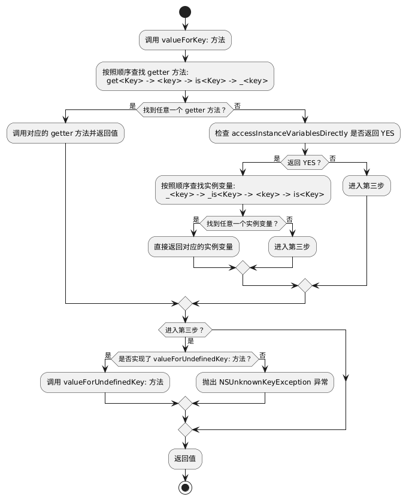

## KVC 基本使用

KVC 全称是 Key-Value Coding，中文意思是“键值编码”，可以通过一个字符串来访问某个属性。它的基本使用如下：

```objc
MJPerson *person = [[MJPerson alloc] init];

[person setValue:@12 forKey:@"age"];

NSLog(@"%d", [person valueForKey:@"age"]);
```

基础 API 如下：

-   setValue:forKey:
-   valueForKey:
-   setValue:forKeyPath:
-   valueForKeyPath:

## KVC setValue 流程

在调用 setValue:forKey: 和 setValue:forKeyPath: 时，是会触发 KVO 的。下面我们来分析一下原理。

当调用 setValue:forKey:设置属性 value 时，其底层的执行流程为

【第一步】首先查找是否有这三种 setter 方法，按照查找顺序为 set<Key>：-> \_set<Key> -> setIs<Key>

如果有其中任意一个 setter 方法，则直接设置属性的 value（主注意：key 是指成员变量名，首字符大小写需要符合 KVC 的命名规范）

如果都没有，则进入【第二步】

【第二步】：如果没有第一步中的三个简单的 setter 方法，则查找 accessInstanceVariablesDirectly 是否返回 YES，

如果返回 YES，则查找间接访问的实例变量进行赋值，查找顺序为：\_<key> -> \_is<Key> -> <key> -> is<Key>

如果找到其中任意一个实例变量，则赋值

如果都没有，则进入【第三步】

如果返回 NO，则进入【第三步】

【第三步】如果 setter 方法 或者 实例变量都没有找到，系统会执行该对象的 setValue：forUndefinedKey:方法，默认抛出 NSUndefinedKeyException 类型的异常



## KVC getValue 流程

当调用 valueForKey：时，其底层的执行流程如下

【第一步】首先查找 getter 方法，按照 get<Key> -> <key> -> is<Key> -> \_<key>的方法顺序查找，

如果找到，则进入【第五步】

如果没有找到，则进入【第二步】

【第二步】如果还没有找到，检查类方法 accessInstanceVariablesDirectly 是否 YES，依次搜索\_<key>，\_is<Key>，<key>或 is<Key>的实例变量

如果搜到，直接获取实例变量的值，进入【第三步】

【第三步】根据搜索到的属性值的类型，返回不同的结果

如果是对象指针，则直接返回结果

如果是 NSNumber 支持的标量类型，则将其存储在 NSNumber 实例中并返回它

如果是是 NSNumber 不支持的标量类型，请转换为 NSValue 对象并返回该对象

【第四步】如果上面几步的方法均失败，系统会执行该对象的 valueForUndefinedKey:方法，默认抛出 NSUndefinedKeyException 类型的异常


