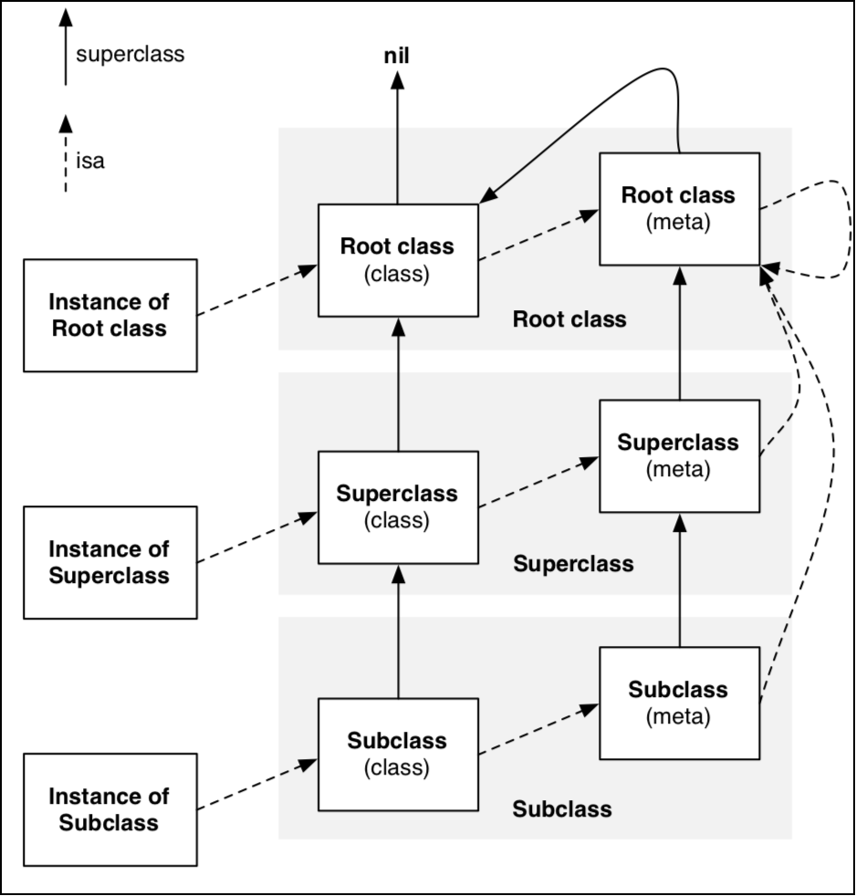
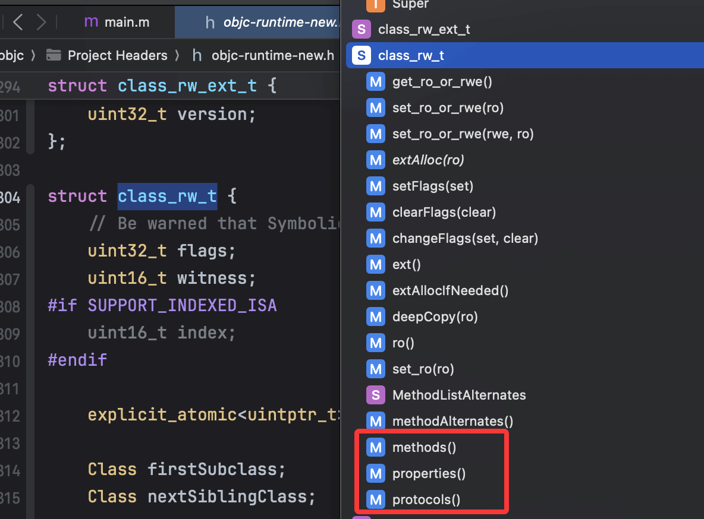
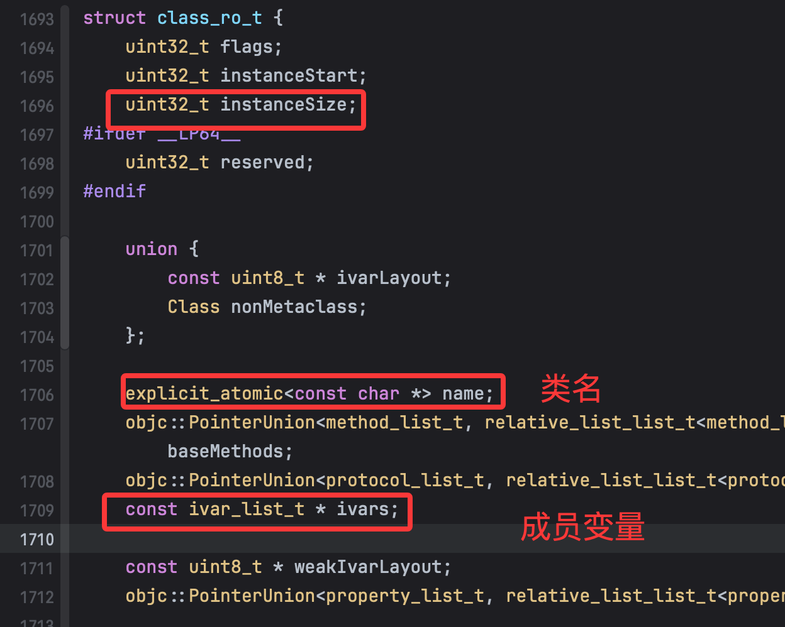

main.m 转为指定平台和架构下的 C/C++文件

```shell
xcrun -sdk iphoneos clang -arch arm64 -rewrite-objc main.m -o main-arm64.cpp
```

NSObject 本质上就是 C/C++里的结构体，里面有一个 Class 类型的成员变量 isa，而 Class 是一个指向结构体的指针。

```cpp
typedef struct objc_class *Class;

struct NSObject_IMPL {
	Class isa; // 8个字节
};


NSObject *obj = [[NSObject alloc] init];
// 获取 NSObject 实例对象的成员变量（ivar）所占用的大小（ 8字节）
NSLog(@"%zd", class_getInstanceSize([obj class]));
// 获取 obj 指针所指向的内存的大小，16 字节
NSLog(@"%zd", malloc_size((__bridge const void *)obj));
```

深入源码来看的话（源码版本：objc4-906），可以发现以下代码：

```objc
size = cls->instanceSize(extraBytes);
if (outAllocatedSize) *outAllocatedSize = size;
id obj = objc::malloc_instance(size, cls);
```

分配内存空间的大小是由 Class 类型的 instanceSize 实例方法返回的，小于 16 字节的时候，会改成 16 字节返回。

```cpp
inline size_t instanceSize(size_t extraBytes) const {
    if (fastpath(cache.hasFastInstanceSize(extraBytes))) {
        return cache.fastInstanceSize(extraBytes);
    }

    size_t size = alignedInstanceSize() + extraBytes;
    // CF requires all objects be at least 16 bytes.
    if (size < 16) size = 16;
    return size;
}
```

## 常用 LLDB 调试指令

### 1. 打印命令

| 命令           | 说明                 |
| -------------- | -------------------- |
| `print` 或 `p` | 打印变量或表达式的值 |
| `po`           | 打印对象描述信息     |

### 2. 读取内存

#### 命令格式

| 命令格式                              | 说明                          |
| ------------------------------------- | ----------------------------- |
| `memory read/数量格式字节数 内存地址` | 使用 memory read 命令读取内存 |
| `x/数量格式字节数 内存地址`           | 使用 x 命令读取内存(简写形式) |

#### 使用示例

示例

-   x/3xw 0x10010：从内存地址 0x10010 开始，读取 3 个 4 字节（word）的数据，以 16 进制格式显示。

格式说明

-   数量：表示要读取的数据个数。
-   格式：

    -   x：16 进制
    -   f：浮点数
    -   d：十进制

-   字节大小：
    -   b：byte（1 字节）
    -   h：half word（2 字节）
    -   w：word（4 字节）
    -   g：giant word（8 字节）

3. 修改内存中的值

命令格式

-   memory write 内存地址 数值

示例

-   memory write 0x0000010 10：将内存地址 0x0000010 处的值修改为 10

## NSObject 子类的内存布局

```objc
@interface Student : NSObject {
    @public
    int _no;
    int _age;
}
@end
```

生成的 cpp 代码如下

```cpp
struct Student_IMPL {
    // 父类的成员会放在前面
	struct NSObject_IMPL NSObject_IVARS;
	int _no;
	int _age;
};

// 可以认为底层实现是这样
struct Student_IMPL {
    Class isa;
    int _no;
    int _age;
}
```

可以简单看出，student 对象占用 16 个字节。

```objc
Student *obj = [[Student alloc] init];
obj->_no = 4;
obj->_age = 5;
NSLog(@"%zd", class_getInstanceSize([obj class]));
NSLog(@"%zd", malloc_size((__bridge const void *)obj));
```

这个时候查看 obj 对应地址的数据，输出如下：

```shell
(lldb) po obj
<Student: 0x6000004a1870>

(lldb) x 0x6000004a1870
0x6000004a1870: 10 81 00 00 01 00 00 00 04 00 00 00 05 00 00 00  ................
0x6000004a1880: 00 b8 80 3f 01 00 00 00 00 00 00 00 00 00 00 00  ...?............
```

可以看到，前 8 位存储 isa，后面 8 位分别存储\_no 和\_age。这里会涉及到一个大端和小端的问题。

排列一个对象的字节有两个通用规则，最低有效字节在最前面的方式称为`小端法`，同理，最高有效字节在最前面的为`大端法`。

iOS 中是小端法，类比一下，我们可以得到 isa 指针指向的地址是 `0x0000000100008110`。可以使用 `p` 指令验证一下

```shell
(lldb) p obj->isa
(Class) 0x0000000100008110
```

这里还会涉及内存对齐相关的知识，可以参考[这篇文章](https://juejin.cn/post/6949579266048655367)。

### 运行时分配

在 Objective-C 中，对象的内存分配受到运行时机制和系统内存对齐策略的影响。示

```objective-c
@interface Student : NSObject {
    int _age;   // 4字节
    int _no;    // 4字节
    int _gender;// 4字节
}
@end
```

以下是分配 32 字节的关键原因：

### 1. 基本内存组成

-   **`isa`指针**：每个 Objective-C 对象继承自`NSObject`，隐含一个`isa`指针（8 字节）。
-   **成员变量**：3 个`int`类型，共 12 字节。
-   **理论大小**：8（isa） + 12（成员） = 20 字节。

### 2. 内存对齐

-   **结构体对齐规则**：整体大小需按最大对齐值（这里是`isa`的 8 字节）对齐，20 字节向上对齐到 **24 字节**。

### 3. 运行时分配策略

-   **16 字节块对齐**：Objective-C Runtime（通过`alloc`）强制内存按 16 字节倍数分配：
    -   24 字节需填充到 **32 字节**（16x2）。

### 4. 验证方法

-   `class_getInstanceSize([Student class])`返回 **24 字节**（计算值）
-   `malloc_size((__bridge const void *)student)`返回 **32 字节**（实际分配值）

### 完整内存结构

| 组成部分       | 大小（字节） | 说明                        |
| -------------- | ------------ | --------------------------- |
| `isa`指针      | 8            | 继承自 NSObject 的隐式指针  |
| `_age`         | 4            | 第一个 int 成员             |
| `_no`          | 4            | 第二个 int 成员             |
| `_gender`      | 4            | 第三个 int 成员             |
| **对齐填充**   | 4            | 对齐到 24 字节（8 的倍数）  |
| **运行时填充** | 8            | 对齐到 32 字节（16 的倍数） |

### 总结

实际分配的 32 字节是编译器对齐规则（到 24 字节）叠加运行时内存分配策略（16 字节块对齐）的综合结果。这种机制避免了内存碎片并提升了访问效率。

## OC 对象分类

Objective-C 中的对象，简称 OC 对象，主要可以分为 3 种:

-   instance 对象（实例对象）
-   class 对象（类对象）
-   meta-class 对象（元类对象）

instance 对象就是通过类 alloc 出来的对象，每次调用 alloc 都会产生新的 instance 对象。

```objc
NSObject *obj1 = [[NSObject alloc] init];
NSObject *obj2 = [[NSObject alloc] init];
```

-   object1、object2 是 NSObject 的 instance 对象（实例对象）
-   它们是不同的两个对象，分别占据着两块不同的内存

instance 对象在内存中存储的信息包括:

-   isa 指针
-   其他成员变量

```objc
Class cls1 = [obj1 class];
Class cls2 = [obj2 class];

Class cls3 = object_getClass(obj1);

Class cls4 = [NSObject class];

NSLog(@"%p %p %p %p", cls1, cls2, cls3, cls4); // 0x100641140 0x100641140 0x100641140 0x100641140
```

cls1 ~ cls4 都是 NSObject 的 class 对象（类对象）,它们是同一个对象。每个类在内存中有且只有一个 class 对象。

class 对象在内存中存储的信息主要包括：

-   isa 指针
-   superclass 指针
-   类的属性信息（@property）、类的对象方法信息（instance method）
-   类的协议信息（protocol）、类的成员变量信息（ivar）

```objc
// 元类对象
Class metaCls = object_getClass([NSObject class]);

// class 方法始终返回类对象，不是元类对象
Class cls = [[NSObject class] class];
```

每个类在内存中有且只有一个 meta-class 对象，meta-class 对象和 class 对象的内存结构是一样的，但是用途不一样，在内存中存储的信息主要包括：

-   isa 指针
-   superclass 指针
-   类的类方法信息（class method）

查看 Class 是否为 meta-class

```objc
#import <objc/runtime>

BOOL result = class_isMetaClass([NSObject class]);
```



-   instance 的 isa 指向 class
-   class 的 isa 指向 meta-class
-   meta-class 的 isa 指向基类的 meta-class。

-   class 里的 superclass 指向父类的 class
-   如果没有父类，superclass 指针为 nil。

-   meta-class 的 superclass 指向父类的 meta-class
-   基类的 meta-class 的 superclass 指向基类的 class

-   instance 调用对象方法，是通过 isa 找到 class，方法不存在，就通过 superclass 找父类

-   class 调用方法，是通过 isa 找 meta-class，方法不存在就通过 superclass 找父类的 meta-class。

这里有一个点，就是 NSObject 的 meta-class 的 superclass 指针指向 NSObject 的 class，有点绕，可以用下面的代码来理解：

```objc
@interface NSObject (Test)
- (void)test;
@end

@implementation NSObject (Test)
- (void)test {
    NSLog(@"-[NSObject test], %p", self);
}
@end

@interface Person: NSObject
@end

@implementation Person
@end

int main(int argc, const char * argv[]) {
    @autoreleasepool {
        NSLog(@"%p %p", [Person class], [NSObject class]);

        [Person test];
        [NSObject test];
    }
    return 0;
}
```

这段代码是可以调用成功的，因为我们通过 Category 的方式给 NSObject 增加了一个对象方法 test。在向 NSObject 的类对发送 test 消息时，会先找到它的元类对象，发现上面没有 test 方法的时候，就会通过 superclass 指针去找它的类对象上的 test 方法，就调用到了 test 这个对象方法。

题外话：

如果实际在 Xcode 中通过 lldb 去获取 对象的 isa，使用下面的命令：

```shell
p/x (long)person->isa

p/x [person class]
```

你可能会发现两个地址不一样，这是因为从切到 64 位以后，获取 isa 指向的实际地址，都需要 `& ISA_MASK`。

## objc_class 结构分析

class、meta-class 对象的本质结构都是 `struct objc_class`。接下来我们来分析一下这个结构体。

```cpp
struct objc_object {
private:
    char isa_storage[sizeof(isa_t)];

    isa_t &isa() { return *reinterpret_cast<isa_t *>(isa_storage); }
    const isa_t &isa() const { return *reinterpret_cast<const isa_t *>(isa_storage); }
// ...
}

struct class_data_bits_t {
    friend objc_class;

    // Values are the FAST_ flags above.
    uintptr_t bits;
    // ...
}

struct objc_class : objc_object {
    // Class ISA;
    Class superclass;
    cache_t cache;             // 方法缓存
    class_data_bits_t bits;    // 用于获取具体的类信息
}
```

这是一个 C++ 的结构体，我们可以看到，它继承自 objc_object，也就是说，class 对象和 meta-class 对象都是 objc_object 对象。我们可以通过 isa() 方法来获取 isa 指针，通过 superclass 指针来获取父类的 class 对象。此外，还有两个重要的成员变量，一个是 cache，一个是 bits。cache 是一个方法缓存，用于提高方法的查找效率，bits 是一个 class_data_bits_t 结构体，用于获取具体的类信息。

要通过 bits 获取类信息，在 objc_class 里有这样一个方法，通过将 bits & FAST_DATA_MASK，来获取到 class_rw_t 的地址，然后再通过这个地址来获取类信息。

```objc
class_rw_t* data() const {
    return (class_rw_t*)(bits & FAST_DATA_MASK);
}
```



在 class_rw_t 结构体中，存放着 methods、properties、protocols 等信息。然后还有一个 ro 的方法，返回只读的 class_ro_t 类型的结构体，这个结构体中存放着 class_rw_t 中的一些只读的信息。


