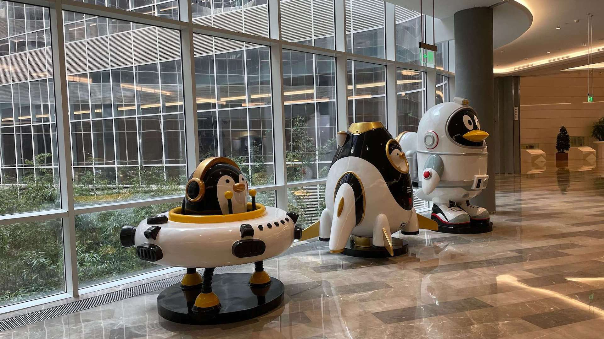
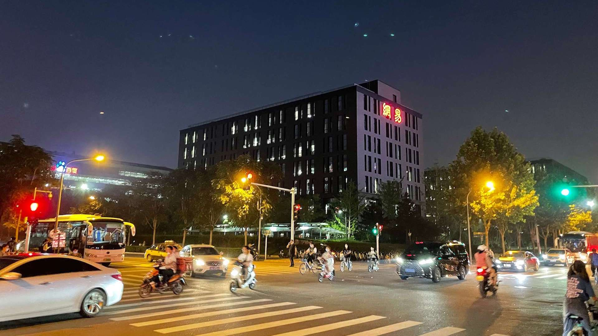

[Github](https://github.com/felikslv01)

[B 站](https://space.bilibili.com/44799291)

## 在校经历

- 2018 年 9 月 武汉理工大学电子信息类工学
- 2019 年 6 月 武汉理工大学电子信息工程专业
- 2020 年 9 月 - 2021 年 6 月 担任校电子科技协会副会长
- 2020 年 9 月 - 2021 年 9 月 HUAWEI Student Developers 成员
- 2020 年 7 月加入 Token 团队，负责新掌理 Android 端的开发

## 工作经历

- 2021 年 7 月 - 2021 年 11 月 腾讯客户端开发实习生
- 2022 年 7 月 - 至今 网易云音乐 iOS 开发

## 一些照片

### 武理

### 北京实习

